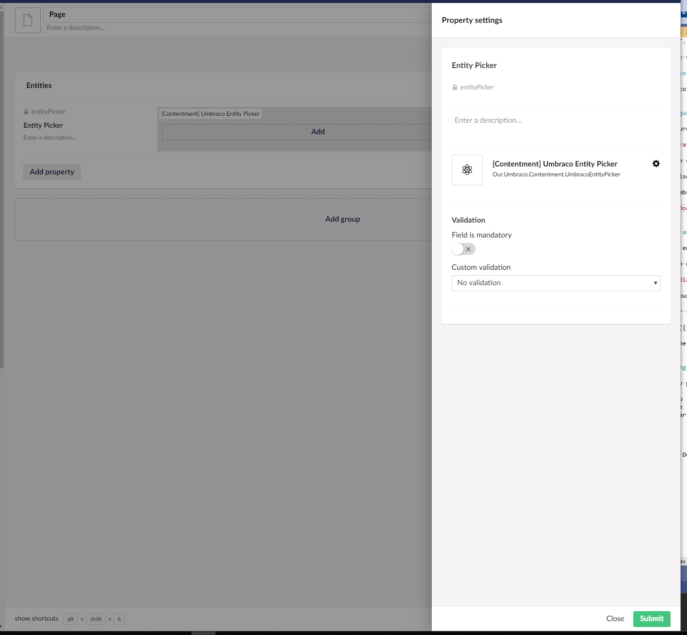

## Umbraco Contentment

### Umbraco Entity Picker

[A single paragraph introduction for the data editor.]

The Umbraco Entity Picker property editor is a property editor that lets you select one or more entities from an Umbraco entity type.


### How to configure the editor

[A few sentences about the configuration editor + screenshots]

To configure an Umbraco entity picker you will want to create a data type in the Umbraco back-office choosing '[Contentment] Umbraco Entity Picker' from the property editor dropdown options.


From there choose the 'Entity Type' that you'd like to pick entities from.

You can also set the maximum number of items to be able to pick if required, along with options to disable sorting and hiding the property label.

With an Umbraco entity picker data type defined, finish off the configuration by adding it to the desired document type definition.




// TODO: You got up to here [LK]


### How to use the editor

[A few sentences about how to use the editor itself + screenshots]

Using the entity picker should be pretty fimilar as it aims to mimic the content picker as closely as possible.

To pick an entity click the 'Add' link to launch the picker dialog. The dialog should present a pagniated list of entities to pick from. If any searchable fields have been configured for the entity type, you can also perform a search by typing a search term in the search input field.


To pick your items simply click on the entity names and then click 'Select' in the bottom right hand corner.

The picker should display a summary of the selected entities and can be sorted by dragging the selected entities into the desired order.


To save the value either save or save and publish the current document.


### How to get the value

[A few sentences about how to get the value + value converter / models builder info]

[Include a code sample.]

The entity picker property editor comes with a built in [value converter](https://our.umbraco.org/documentation/extending/property-editors/value-converters) meaning that whenever you retrieve the property value from Umbraco it will return the actual selected entities.

````csharp
// Example
foreach(var p in Model.Content.People.Cast<Person>()){
    ...
}
````

**Note:** Due to the fact that the property editor can link to any entity type, the returned value type from the value converter will be `IEnumerable<object>` and so will require the entities to be cast to the desired concrete type.


### How to configure as a Parameter Editor

[Add a coulple of sentences on how to configure this editor as a Parameter Editor.]

[Include a code snippet.]
[Take inspiration from: https://our.umbraco.com/packages/developer-tools/parameter-editor-generator/]
[https://our.umbraco.com/packages/backoffice-extensions/tinymce-for-macro-parameters/]
