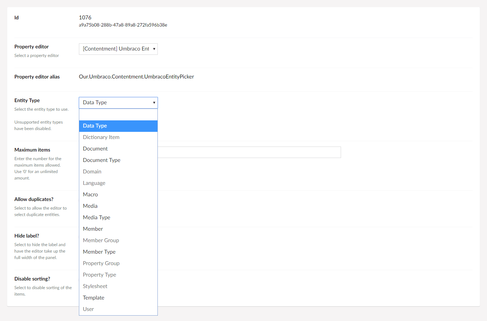
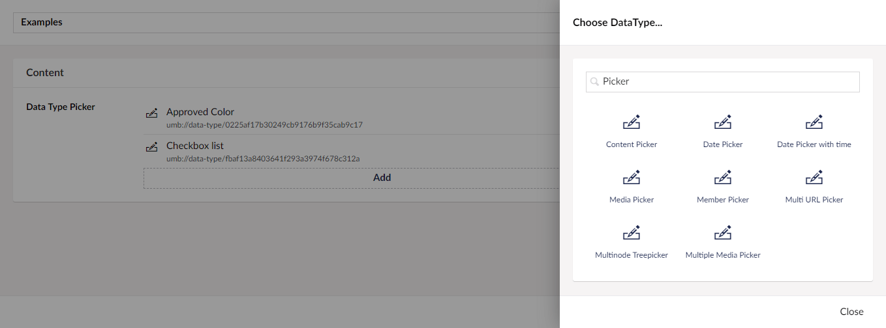

## Umbraco Contentment

### Umbraco Entity Picker

Umbraco Entity Picker is a property editor that lets you select one or more entities from an Umbraco entity type.


### How to configure the editor?

Once you have created a new Data Type and selected the "[Contentment] Umbraco Entity Picker" option, you will see the following configuration fields.



The main field is "**Entity Type**", from here you can select the entity type that you'd like to pick entities from.

> The entity type options are populated from Umbraco's [`UmbracoEntityTypes`](https://github.com/umbraco/Umbraco-CMS/blob/release-8.0.2/src/Umbraco.Web/Models/ContentEditing/UmbracoEntityTypes.cs) enumeration.

You can also set the maximum number of items to be able to pick if required, along with options to allow duplicate selections, disable sorting and hiding the property label.


### How to use the editor?

Once you have added the configured Data Type to your Document Type, the Umbraco Entity Picker will be displayed on the content page's property panel.

Using the entity picker should feel familiar, as it reuses Umbraco's content picker UI.

To pick an entity, press the "Add" link to open the picker's overlay panel. This will display a list of entities which you can select from. You can also filter the items using the search box at the top of the panel.



Once you have selected items, you will be able to sort by dragging the entities into the desired order.


### How to get the value?

[A few sentences about how to get the value + value converter / models builder info]

[Include a code sample.]

````csharp
// Example
foreach(var item in Model.Whatever){
    ...
}
````
