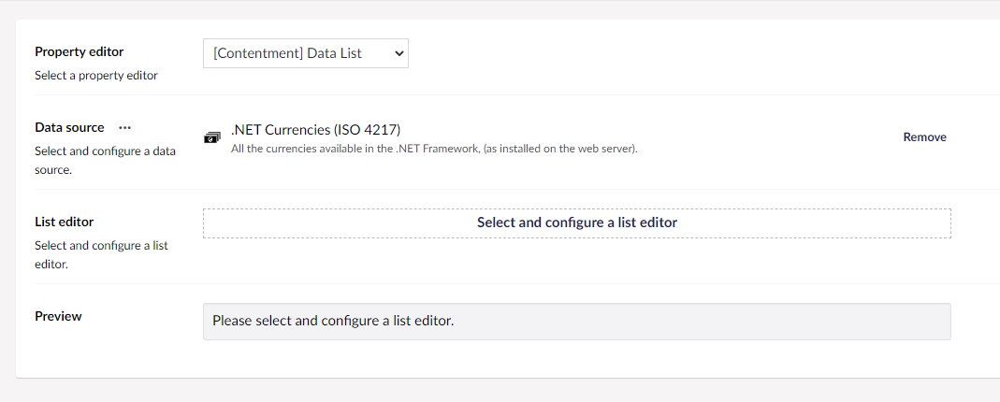

## Contentment for Umbraco

### Data Sources

#### .NET Currencies (ISO 4217)

All the currencies available in the .NET Framework, (as installed on the web server).

##### How to configure the editor?

In your new Data Type, selected the `[Contentment] Data List` option and then the `.NET Currencies (ISO 4217)` Data source. You will see the following configuration fields.

Please see the [Data List editor page](../editors/data-list.md) for more information on the List editor options.

##### What is the value's object-type?

The value of the editor will always be the 3 letter ISO code (e.g. GBP or USD) as a `string` but depending on the `List editor` used, this may be wrapped in a `List<string>`.

###### String Value List Editors

**Buttons (single)**  
**Type:** System.String  
**Example Value:** "AED"    

**Dropdown List**  
**Type:** System.String  
**Example Value:** "AED"    

**Radio Button List**  
**Type:** System.String  
**Example Value:** "AED"    

**Templated List (single)**  
**Type:** System.String  
**Example Value:** "AED"    

###### `List<string>` Value List Editors

**Buttons (multi)**  
**Type:** System.Collections.Generic.List`1[System.String]  
**Example Value:** ["AED", "AFN"]    

**Checkbox List**  
**Type:** System.Collections.Generic.List`1[System.String]  
**Example Value:** ["AED", "AFN"]   

**Item Picker**  
**Type:** System.Collections.Generic.List`1[System.String]  
**Example Value:** ["AED", "AFN"]    
 
**Tags**  
**Type:** System.Collections.Generic.List`1[System.String]  
**Example Value:** ["AED", "AFN"]    

**Templated List (multi)**  
**Type:** System.Collections.Generic.List`1[System.String]  
**Example Value:** ["AED", "AFN"]