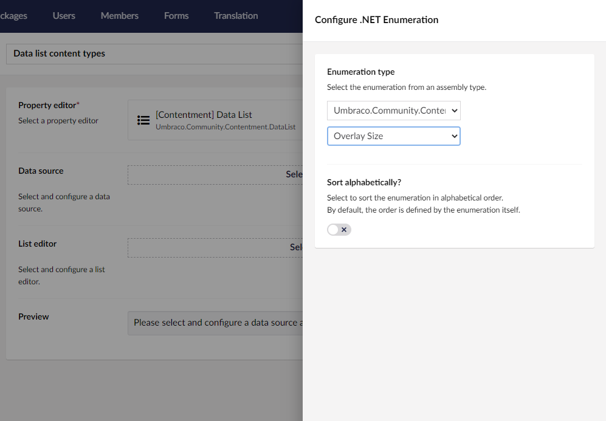

## Contentment for Umbraco

### Data Sources

#### .NET Enumeration

Select an enumeration from a .NET assembly as the data source.

##### How to configure the editor?

Select the desired enumeration, by selecting the containing .NET assembly, and then the enumeration type. You can opt to sort the values alphabetically in the data source too.

##### What is the value's object-type?

The value returned from the List editor is the configured enumeration type.

Depending on the `List editor` used, this may be wrapped in a `List<T>`.
