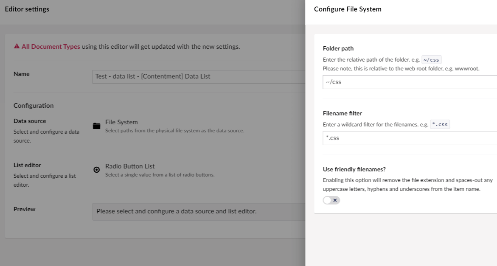

## Contentment for Umbraco

#### File System

This data-source enables you to enter the folder path on the web-server's file system, using it to populate the items of a compatible editor, e.g. [Data List](../editors/data-list.md).

##### How to configure the editor?

The configuration of the File System data-source has the following options:

The first field is **Folder path**, here you can enter the local relative folder path.

e.g. `https://leekelleher.com/umbraco/contentment/` or `~/umbraco/config/lang/`

The next set of fields to enter **Filename filter**, e.g. `*.css`.

##### What is the value's object-type?

The value for the File System data-source item is a `string`.
