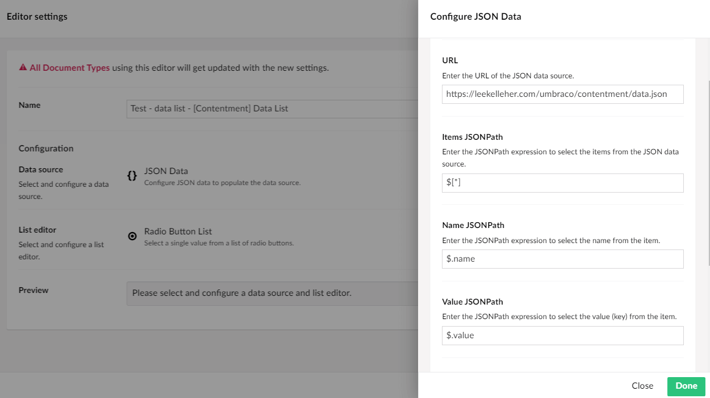

## Contentment for Umbraco

### Data Sources

#### JSON Data

This data-source enables you to enter the URL of a JSON data source, using it to populate the items of a compatible editor, e.g. [Data List](../editors/data-list.md).

##### How to configure the editor?

The configuration of the JSON data-source has the following options:

The first field is URL, here you can enter either a remote URL, or a local relative file path.

e.g. `https://leekelleher.com/umbraco/contentment/data.json`

You must only use a URL that have a domain of the JSON data source not a relative URL.

The next set of fields are the JSONPath expressions used to populate the data-source's items from the JSON data.

**Items JSONPath** is to used to populate the item. **Name JSONPath** is to select the item's name. Note that this JSONPath is used within the context of the item, so only needs to be relative to the item' JSON node itself, e.g. `@name` will select the item's `name` attribute. The same follows for the **Value JSONPath**, **Icon JSONPath**, and **Description JSONPath** fields.

> If you need help with JSONPath expressions and syntax, please refer to this resource: <https://goessner.net/articles/JsonPath>.

##### What is the value's object-type?

The value for the JSON data-source item is a `string`.
Depending on the `List editor` used, this may be wrapped in a `List<string>`.
