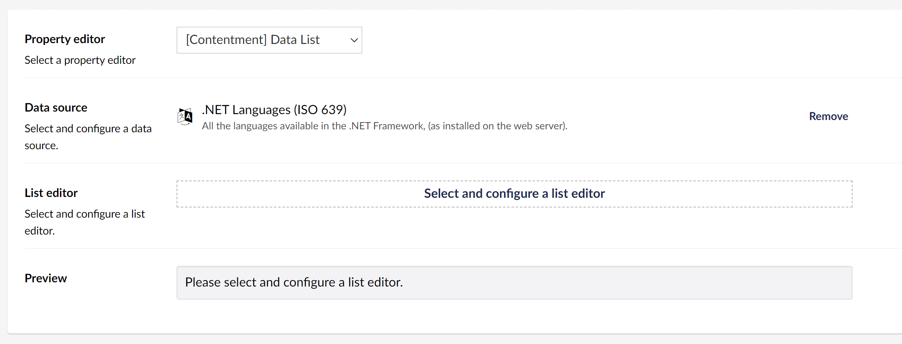

## Contentment for Umbraco

### Data Sources

#### .NET Languages (ISO 639-1)

This data-source will use all the languages available in the .NET Framework, (as installed on the web server), to populate the items of a compatible editor, e.g. [Data List](../editors/data-list.md).

##### How to configure the editor?

In your new Data Type, selected the `[Contentment] Data List` option and then the `.NET Languages (ISO 639)` Data source. You will see the following configuration fields.

Please see the [Data List editor page](../editors/data-list.md) for more information on the List editor options.

##### What is the value's object-type?

The value of the editor will always be the 2 letter ISO code (e.g. en or fr) as a `string` but depending on the `List editor` used, this may be wrapped in a `List<string>`.

**Note** that ISO 639-1 Alpha 2 code is used, so there is no differentiation between variations of the same language. For example English(Europe) and English(Fiji) will both have the value "en".
