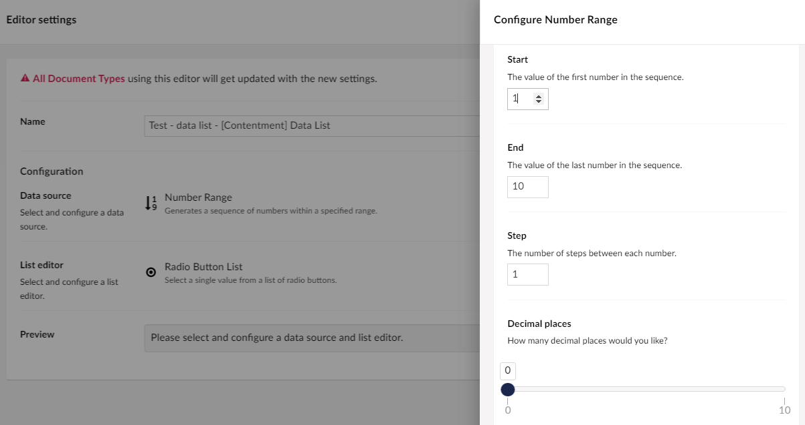

## Contentment for Umbraco

### Data Sources

#### Number Range

This data-source enables you to enter the Number Range data source, using it to populate the items of a compatible editor, e.g. [Data List](../editors/data-list.md).

##### How to configure the editor?

The configuration of the Number Range data-source has the following options:

The first and second fields are to enter the values of the start and end of the sequence.

The third and forth fields are to configure the number of steps between each number and the amount of decimal places you want.

##### What is the value's object-type?

The value for the Number Range data-source item is a `double`.
