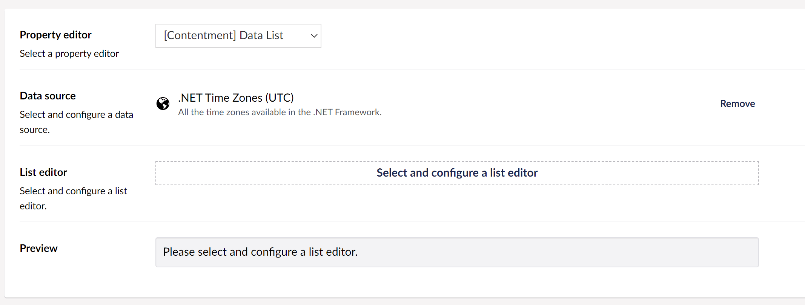

## Contentment for Umbraco

### Data Sources

#### .NET Time Zones (UTC)

This data-source will use all the time zones available in the .NET Framework to populate the items of a compatible editor, e.g. [Data List](../editors/data-list.md).

##### How to configure the editor?

In your new Data Type, selected the `[Contentment] Data List` option and then the `.NET Time Zones (UTC)` Data source. You will see the following configuration fields.

Please see the [Data List editor page](../editors/data-list.md) for more information on the List editor options.

##### What is the value's object-type?

The value of the editor will always be an instance of the [System.TimeZoneInfo](https://docs.microsoft.com/en-us/dotnet/api/system.timezoneinfo) class but depending on the `List editor` used, this may be wrapped in a `List<System.TimeZoneInfo>`.
