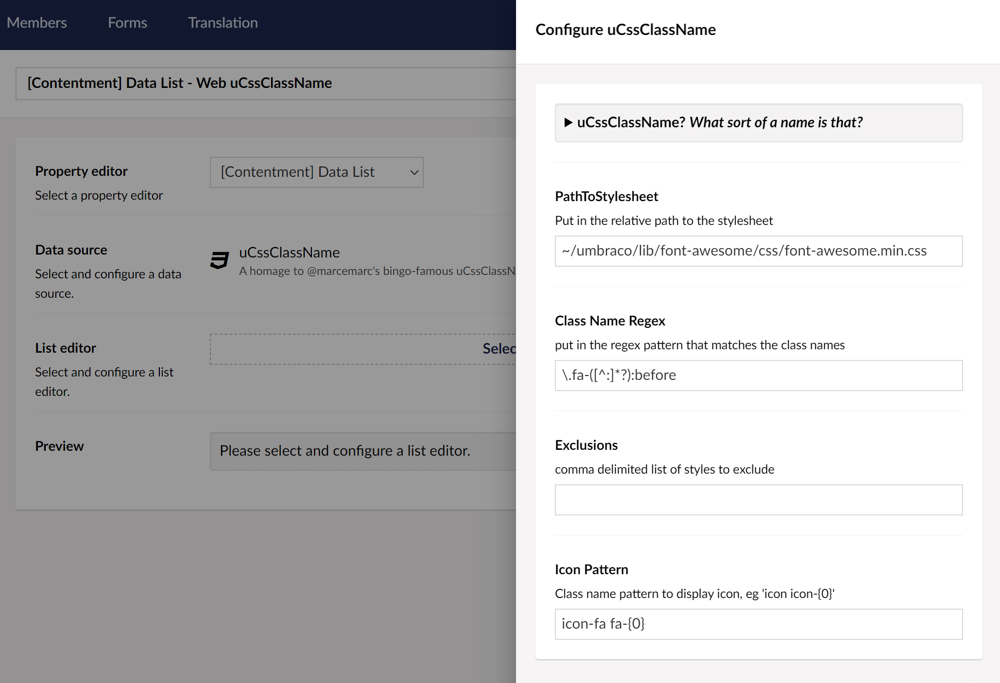

## Contentment for Umbraco

### Data Sources

#### uCssClassName

A homage to @marcemarc's bingo-famous [uCssClassNameDropdown](https://our.umbraco.com/packages/backoffice-extensions/ucssclassnamedropdown/) package!

This data-source enables you to select the class names from a local CSS file, to populate the items of a compatible editor, e.g. [Data List](../editors/data-list.md).

##### How to configure the editor?

The configuration of the uCssClassName data-source has the following options:

The first field is **Path to stylesheet**, here you can enter a local relative CSS file path.

e.g. `~/umbraco/lib/font-awesome/css/font-awesome.min.css`

The next field **Class Name Regex** is used to set the [Regular Expression (RegEx)](https://docs.microsoft.com/en-us/dotnet/standard/base-types/regular-expressions) pattern to match the class names in the CSS file. For the [FontAwesome](https://fontawesome.com/) example, this would be `\.fa-([^:]*?):before`.

The next field is for **Exclusions** _(optional),_ a comma-separated list of partial class names to exclude from the resulting list.

The last field is **Icon Pattern**, this is a formatted string to set the icon's class for inside the Umbraco backoffice. In the case of FontAwesome, this would be `icon-fa fa-{0}`.

##### What is the value's object-type?

The value for the uCssClassName data-source item is a `string`.
Depending on the `List editor` used, this may be wrapped in a `List<string>`.
