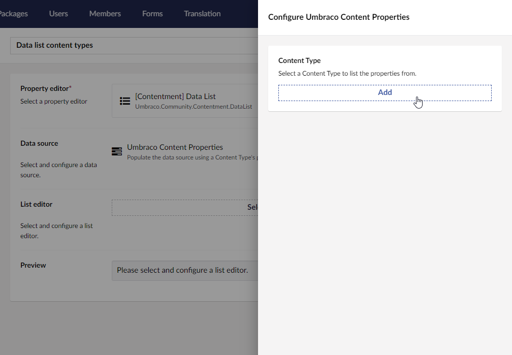

## Contentment for Umbraco

### Data Sources

#### Umbraco Content Properties

Populate the data source using a Content Type's properties.

##### How to configure the editor?

The editor lets you select the desired Content Type to pick properties from. You can configure each Data Source with one Content Type.

##### What is the value's object-type?

The value returned from the List editor is an `string` containing the alias of the selected content property.

Depending on the `List editor` used, this may be wrapped in a `List<string>`.
