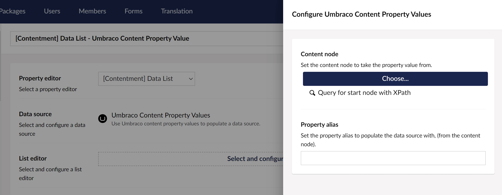

## Contentment for Umbraco

### Data Sources

#### Umbraco Content Property Values

Populate the data source using Umbraco content property values

##### How to configure the editor?

The editor give you two options for selecting the content node to take the property value - either by choosing a specific node using a Content Picker or by specifying an XPath query that selects the node:

**Note:** If the XPath query returns more than a single node, only the first matching node will be used.

The second field is to set the property alias to populate the data source with, (from the selected content node).

###### Now what?

You're most likely asking yourself, _"okay, so where do the values come from?"_ Good question!

The data-source will attempt to detect the property's type and understand it's data structure. The following property-editors have built-in support...

- **Textbox (aka Textstring) (and [Text Input](https://github.com/leekelleher/umbraco-contentment/blob/develop/docs/editors/text-input.md))** - will attempt to delimit the text value by comma (CSV). Each item will be used as both Name and Value.
- **Textarea** - will attempt to delimit by a new line (i.e. `CRLF`). Each item will be used as both Name and Value.
- **Repeatable Textstring (aka Multiple Textstring)** - the text from each item (row) is used as both Name and Value.
- [**Data List**](https://github.com/leekelleher/umbraco-contentment/blob/develop/docs/editors/data-list.md) - the value from the selected item(s) will be used as both the Name and Value.
- [**List Items**](https://github.com/leekelleher/umbraco-contentment/blob/dev/develop/docs/editors/list-items.md) - this editor offers full control, it can set the Name, Value, Icon and Description. :dart:
- [**Social Links**](https://github.com/leekelleher/umbraco-contentment/blob/develop/docs/editors/social-links.md) - each item will use the Name, the Value will use the Network (e.g. Twitter), the Icon will prefix the Network with `"icon-"` and the Description will use the Url value.
- [**Textbox List**](https://github.com/leekelleher/umbraco-contentment/blob/develop/docs/editors/textbox-list.md) - the name/value from each item will be used for the Name and Value.

**Support for other editors?**

If you have a custom property-editor that you would like to add support for, you will need to create a new C# class that implements the [`Umbraco.Community.Contentment.DataEditors.IDataListItemPropertyValueConverter`](https://github.com/leekelleher/umbraco-contentment/blob/develop/src/Umbraco.Community.Contentment/DataEditors/DataList/IDataListItemPropertyValueConverter.cs) interface.

This interface contains two methods: `IsConverter(propertyType)` and `ConvertTo(property)`; the first is to match the converter with the property-type; the second is to do the value conversion.

To see examples of this, you can either see the built-in converters, ([in the `DataList/DataListItemPropertyValueConverters` directory](https://github.com/leekelleher/umbraco-contentment/tree/develop/src/Umbraco.Community.Contentment/DataEditors/DataList/DataListItemPropertyValueConverters)) or take a look at prototype code that I wrote to support the [Content Blocks](https://github.com/leekelleher/umbraco-contentment/blob/develop/docs/editors/content-blocks.md) editor, see: [`ContentmentContentBlocksDataListItemPropertyValueConverter.cs`](https://github.com/leekelleher/umbraco-contentment/blob/develop/src/Umbraco.Cms.11.x/DataSources/ContentmentContentBlocksDataListItemPropertyValueConverter.cs). _(Wow, that's a long filename!)_

##### What is the value's object-type?

The value returned from the List editor is an `string` containing the item value of the selected content property.

Depending on the `List editor` used, this may be wrapped in a `List<string>`.

##### History

Inspiration for this data-source came from @TimGeyssens' article: "[Content Editor defined dropdowns/checkboxlists and radiobuttonlists in Umbraco v8 with Contentment](https://dev.to/timgeyssens/content-editor-defined-dropdowns-checkboxlists-and-radiobuttonlists-in-umbraco-v8-with-contentment-123f)".

Tim made the original source code [available on a gist](https://gist.github.com/TimGeyssens/5e9e156d66c3d85d0bfb24a1ae9a7504), which I made modifications on a [forked gist](https://gist.github.com/leekelleher/d786f4b72e7c16f37fb22d4d23c1b516)... up to a point where I was happy to include it in Contentment.
