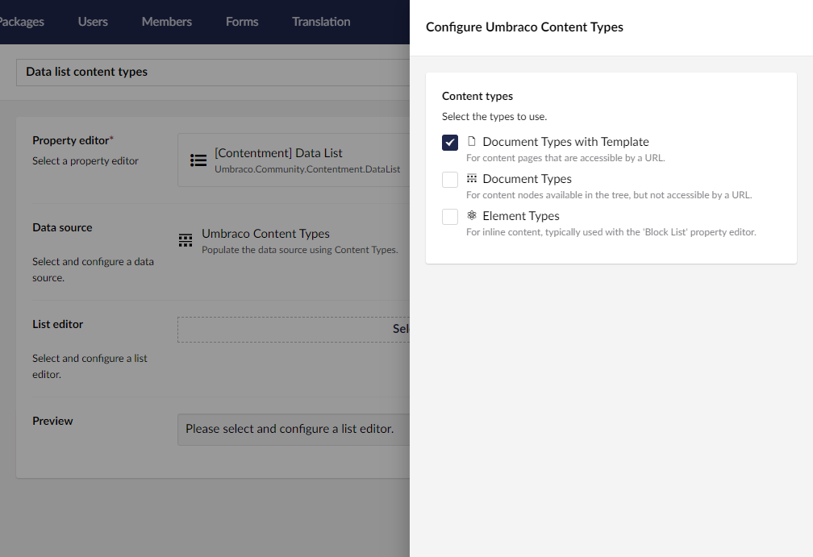

## Contentment for Umbraco

### Data Sources

#### Umbraco Content Types

Populate the data source using Content Types.

##### How to configure the editor?

Select the content types that should be available in the data source. You can select between Document Types with or without templates, or Element Types.

##### What is the value's object-type?

The value returned from the List editor is an `IPublishedContentType`.

Depending on the `List editor` used, this may be wrapped in a `List<IPublishedContentType>`.
