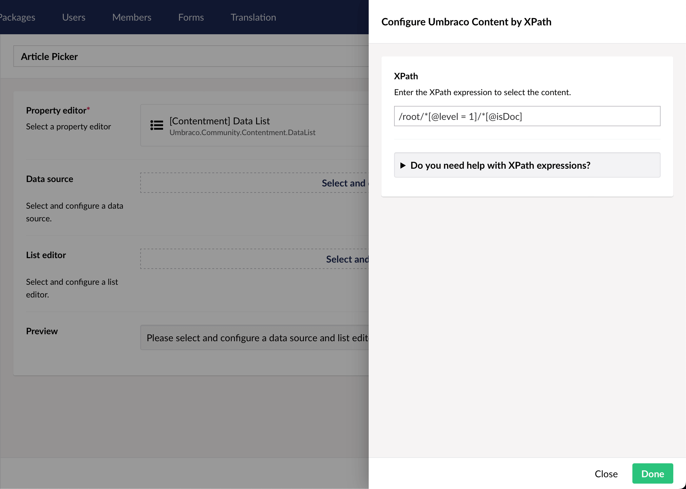

## Contentment for Umbraco

### Data Sources

#### Umbraco Content by XPath

Use an XPath query to select Umbraco content to use as the data source.

##### How to configure the editor?

The configuration of the Umbraco Content by XPath data-source has a single option:

The **XPath** field allows you to use an XPath expression to select a set of Umbraco nodes for use in the List editor.

If you need help constructing an expression, there's a built-in help sheet that has a link to the MDN Web Docs, as well as information about a short list of placeholder values that can be used to give the expression a known starting point (e.g. `$root` or `$site`).

##### What is the value's object-type?

The value returned from the List editor is an `IPublishedContent`.

Depending on the `List editor` used, this may be wrapped in a `List<IPublishedContent>`.

