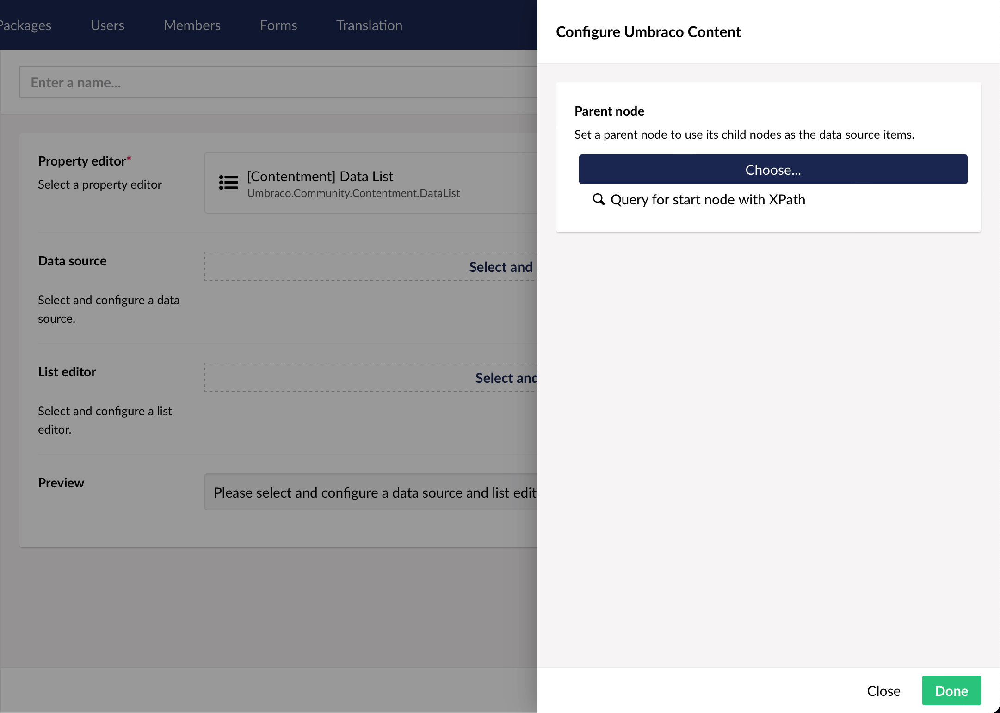
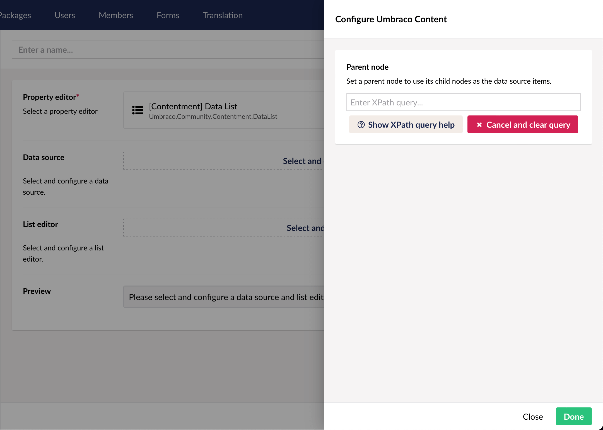

## Contentment for Umbraco

### Data Sources

#### Umbraco Content

Select a start node to use its children as the data source.

##### How to configure the editor?

The editor give you two options for selecting the start node - by choosing a specific node using a Content Picker:

\- or by specifying an XPath query that selects the node:

**Note:** If the XPath query returns more than a single node, only the first matching node will be the one that's used as a parent for the data-source.

##### What is the value's object-type?

The value returned from the List editor is an `IPublishedContent`.

Depending on the `List editor` used, this may be wrapped in a `List<IPublishedContent>`.
