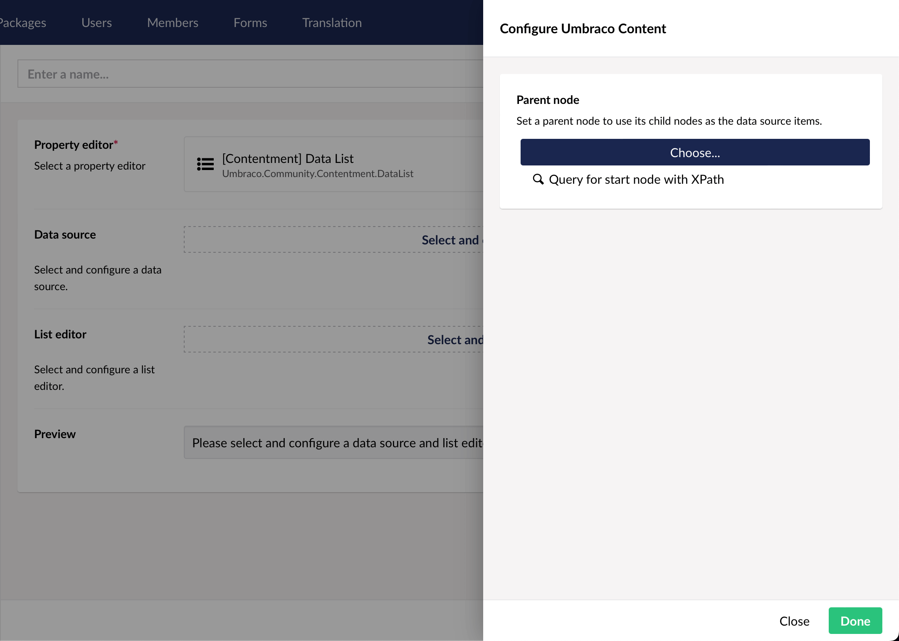
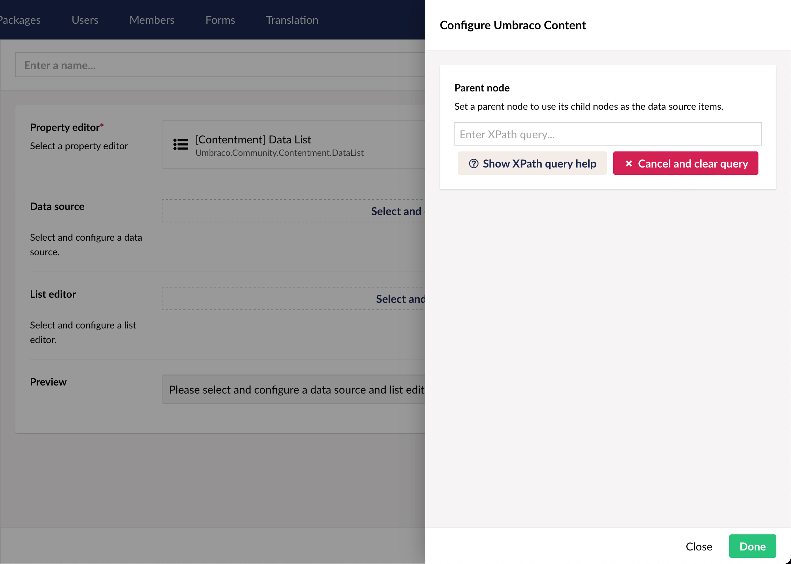

## Contentment for Umbraco

### Data Sources

#### Umbraco Content

Select a start node to use its children as the data source.

##### How to configure the data-source?

<!-- TODO: both screenshots below predate this section (Sep 2023) and only ever
     showed the "Parent node" field. They need retaking against a running host
     site to depict the current configuration panel - including the Dynamic
     Root option (replacing the XPath query field shown previously), Document
     type filter, Show unpublished?, Image alias, and Sort alphabetically?. -->

The **Parent node** field gives you two options for selecting the start node - either by choosing a specific node using a Content Picker, or by configuring a Dynamic Root query that resolves a node relative to the current content (the same Dynamic Root mechanism used by the built-in Content Picker and Multi Node Tree Picker):

**Note:** If the Dynamic Root query resolves to more than a single node, only the first matching node will be used as the parent for the data-source.

The remaining configuration fields are:

- **Document type filter** - _(optional)_ select one or more document types to filter the child nodes. By default, all child nodes are returned regardless of their document type.
- **Show unpublished?** - select to include child nodes that have not been published. By default, only published nodes are returned.
- **Image alias** - _(optional)_ when using the `Cards` display mode, you can set a thumbnail image by entering the property alias of the media picker. The default alias is `image`.
- **Sort alphabetically?** - select to sort the content items in alphabetical order. By default, the order is defined by the Umbraco content sort order.

##### What is the value's object-type?

The value returned from the List editor is an `IPublishedContent`.

Depending on the `List editor` used, this may be wrapped in a `List<IPublishedContent>`.
