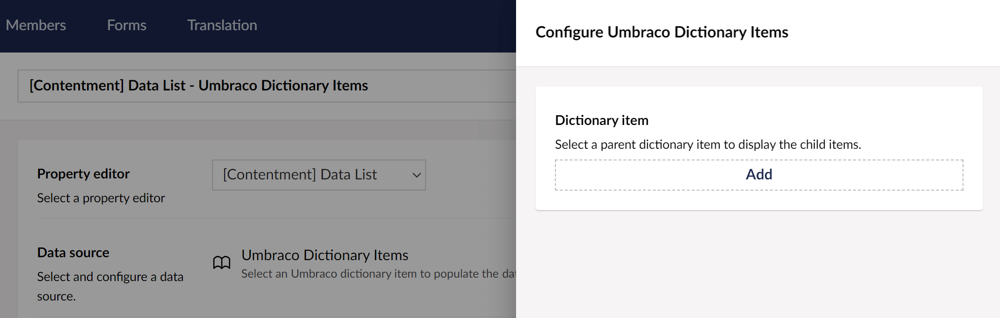

## Contentment for Umbraco

### Data Sources

#### Umbraco Dictionary Item

This data-source lets you use the child dictionary items from a selected parent dictionary item to populate the options of a compatible editor, e.g. [Data List](../editors/data-list.md).

##### How to configure the editor?

The configuration of the Umbraco dictionary item data-source has the following options:

The **Dictionary item** field will let you select the parent dictionary item to display the child items from.

##### What is the value's object-type?

The value for the Umbraco dictionary data-source item is a `string` of the dictionary item's key (alias).
Depending on the `List editor` used, this may be wrapped in a `List<string>`.

