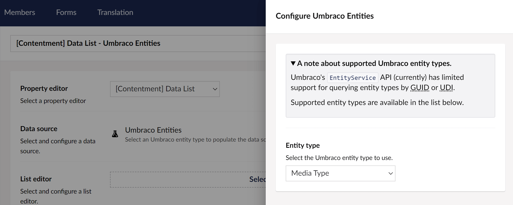

## Contentment for Umbraco

### Data Sources

#### Umbraco Entities

This data-source lets you to select an Umbraco entity type to populate the items of a compatible editor, e.g. [Data List](../editors/data-list.md).

> **A note about supported Umbraco entity types.**
> 
> Umbraco's [`EntityService`](https://github.com/umbraco/Umbraco-CMS/blob/release-8.17.0/src/Umbraco.Core/Services/Implement/EntityService.cs) API (currently) has limited support for querying entity types by GUID or UDI.
> 
> At the time of writing, the available supported entity types are:
> - Data Type
> - Document
> - Document Blueprint
> - Document Type
> - Media
> - Media Type
> - Member
> - Member Type

##### How to configure the editor?

The configuration of the Umbraco entities data-source has the following options:

The **Entity type** field will let you select the Umbraco entity type to use.

##### What is the value's object-type?

The value for the Umbraco entities data-source item will be an instance of [`IEntitySlim`](https://github.com/umbraco/Umbraco-CMS/blob/release-8.17.0/src/Umbraco.Core/Models/Entities/IEntitySlim.cs), representing a slim version of the entity object.
Depending on the `List editor` used, this may be wrapped in a `List<IEntitySlim>`.

To retrieve the full instance of the entity, you would need to make a call to the corresponding Service API. Please keep in mind that these may query the database directly.
