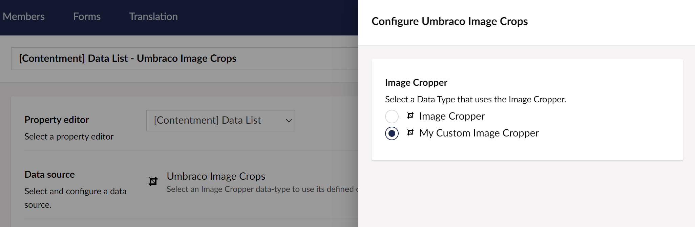

## Contentment for Umbraco

### Data Sources

#### Umbraco Image Crops

This data-source lets you to use crops defined in an Umbraco Image Cropper data-type to populate the items of a compatible editor, e.g. [Data List](../editors/data-list.md).

##### How to configure the editor?

The configuration of the Umbraco image crops data-source has the following options:

The **Image Cropper** field will let you select an existing Umbraco Image Cropper data-type select the defined crops from.

##### What is the value's object-type?

The value for the Umbraco image crops item is a `string` of the crop's alias.
Depending on the `List editor` used, this may be wrapped in a `List<string>`.
