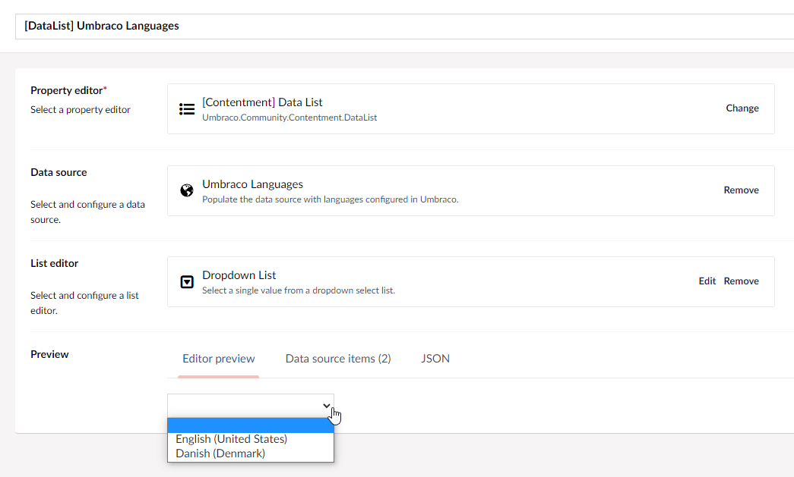

## Contentment for Umbraco

### Data Sources

#### Umbraco Languages

This data-source enables you to use Umbraco languages to populate the items of a compatible editor, e.g. [Data List](../editors/data-list.md).

##### How to configure the editor?

The Umbraco languages data-source does not have any configuration options. It will list all the available languages configured within Umbraco.

##### What is the value's object-type?

The value for the Umbraco languages data-source item will be the 2 letter ISO code (e.g. en or fr) as a `string`.
Depending on the `List editor` used, this may be wrapped in a `List<string>`.

