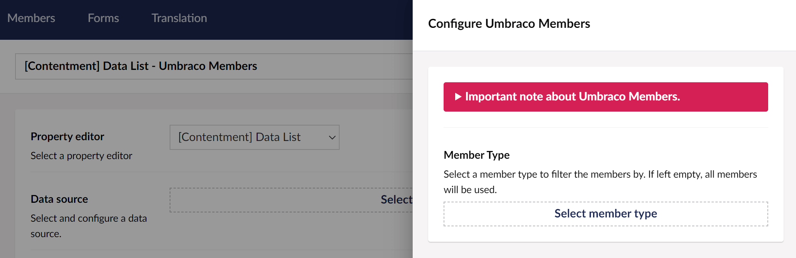

## Contentment for Umbraco

### Data Sources

#### Umbraco Members

This data-source enables you to use Umbraco members to populate the items of a compatible editor, e.g. [Data List](../editors/data-list.md).

> **An important note about the Umbraco Members data-source.**
> This data source is ideal for smaller number of members, e.g. under 50. Upwards of that, you will notice an unpleasant editor experience and rapidly diminished performance.

##### How to configure the editor?

The configuration of the Umbraco members data-source has the following options:

The **Member Type** field will let you select an Umbraco member type to filter the members by. If left empty, all members will be used.

##### What is the value's object-type?

The value for the Umbraco Members data-source item will be an instance of `IPublishedContent`, representing the member's properties.
Depending on the `List editor` used, this may be wrapped in a `List<IPublishedContent>`.
