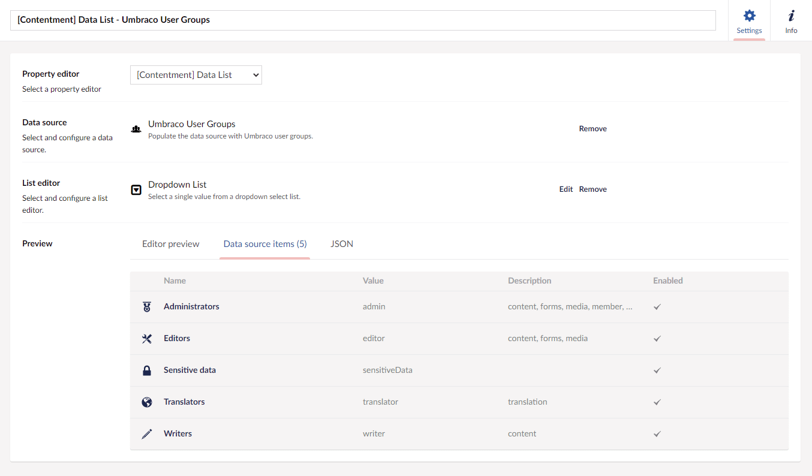

## Contentment for Umbraco

### Data Sources

#### Umbraco User Groups

This data-source uses the Umbraco user groups (roles) to populate the items of a compatible editor, e.g. [Data List](../editors/data-list.md).

##### How to configure the editor?

The Umbraco User Groups data-source does not have any configuration options.

The item values will be the names and aliases from the Umbraco user groups (roles).

##### What is the value's object-type?

The value for the Umbraco User Groups data-source item is an [`IUserGroup`](https://github.com/umbraco/Umbraco-CMS/blob/release-9.0.0/src/Umbraco.Core/Models/Membership/IUserGroup.cs) object-type. Typically, this will be a concrete class of [`UserGroup`](https://github.com/umbraco/Umbraco-CMS/blob/release-9.0.0/src/Umbraco.Core/Models/Membership/UserGroup.cs), _(unless if you are doing advanced user group management?)._

Depending on the `List editor` used, this may be wrapped in a `List<IUserGroup>`.
