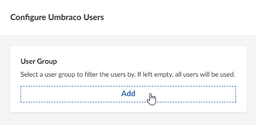
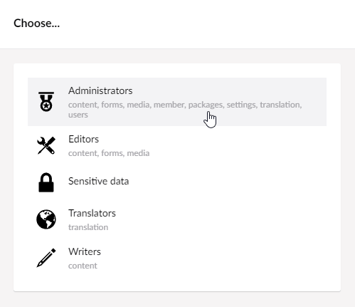
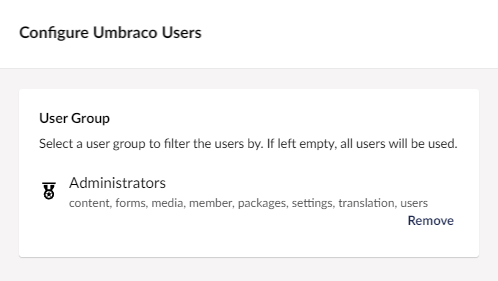
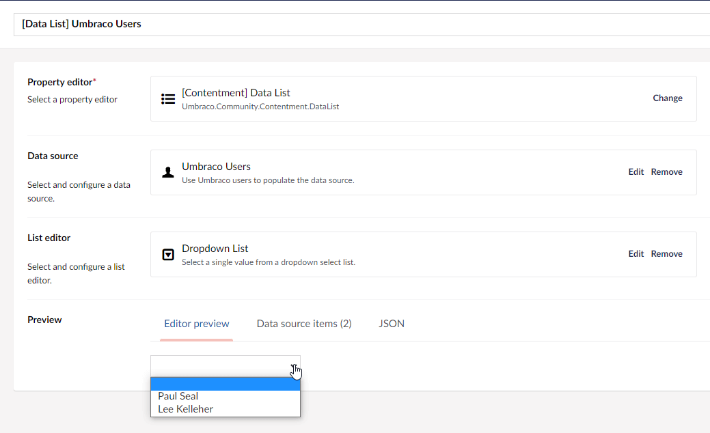

## Contentment for Umbraco

### Data Sources

#### Umbraco Users

This data-source uses the Umbraco users to populate the items of a compatible editor, e.g. [Data List](../editors/data-list.md).

##### How to configure the editor?

The configuration of the Umbraco Users data-source has one option, to select a **User Group** (role) to filter the users that are listed. If left empty, then all users will be listed.

##### What is the value's object-type?

The value for the Umbraco Users data-source item is an [`IUser`](https://github.com/umbraco/Umbraco-CMS/blob/release-9.0.0/src/Umbraco.Core/Models/Membership/IUser.cs) object-type. Typically, this will be a concrete class of [`User`](https://github.com/umbraco/Umbraco-CMS/blob/release-9.0.0/src/Umbraco.Core/Models/Membership/User.cs), _(unless if you are doing advanced user group management?)._

Depending on the `List editor` used, this may be wrapped in a `List<IUser>`.

