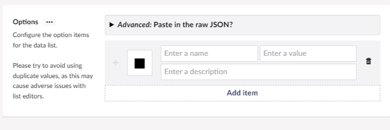

## Contentment for Umbraco

### Data Sources

#### User-defined List

This data-source enables you to manually configure the items of a compatible editor, e.g. [Data List](../editors/data-list.md).

##### How to configure the editor?

The configuration of the User-defined List data-source has the following options:

Press "Add item" button and fill the fields manually, or choose the advanced option to paste in the raw JSON.

##### What is the value's object-type?

The value for the User-defined List data-source item is a `string`.
Depending on the `List editor` used, this may be wrapped in a `List<string>`.

