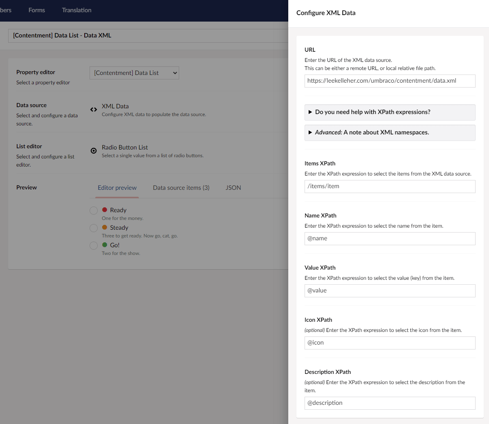

## Contentment for Umbraco

### Data Sources

#### XML Data

This data-source enables you to enter the URL of an XML data source, using it to populate the items of a compatible editor, e.g. [Data List](../editors/data-list.md).

##### How to configure the editor?

The configuration of the XML data-source has the following options.

The first field is **URL**, here you can enter either a remote URL, or a local relative file path.

e.g. `https://leekelleher.com/umbraco/contentment/data.xml` or `~/umbraco/config/lang/en.xml`

The next set of fields are the XPath expressions used to populate the data-source's items from the XML data.

**Items XPath** is to used to populate the item. **Name XPath** is to select the item's name. Note that this XPath is used within the context of the item, so only needs to be relative to the item' XML node itself, e.g. `@name` will select the item's `name` attribute. The same follows for the **Value XPath**, **Icon XPath**, and **Description XPath** fields.

> If you need help with XPath expressions and syntax, please refer to this resource: <https://www.w3schools.com/xml/xpath_intro.asp>.

> **An advanced note about XML namespaces.** If your XML data source contains namespaces, these will be automatically loaded in. For default namespaces (without a prefix), these will be prefixed with `ns` followed by a number, e.g. first will be `ns1`, second will be `ns2`, and so forth.

##### What is the value's object-type?

The value for the XML data-source item is a `string`.

