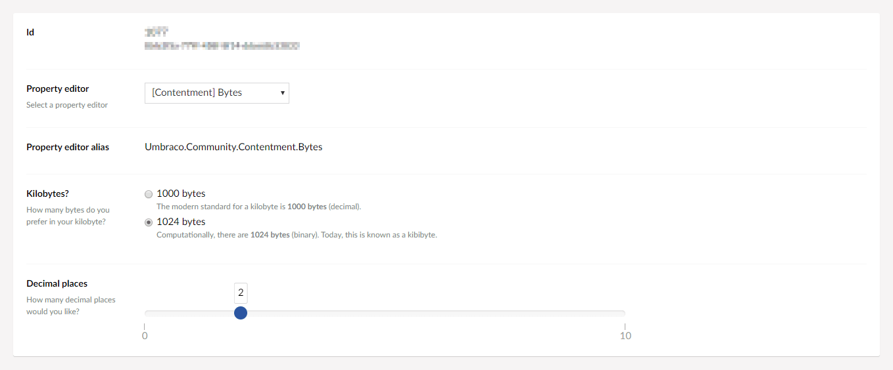
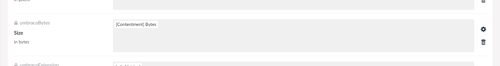
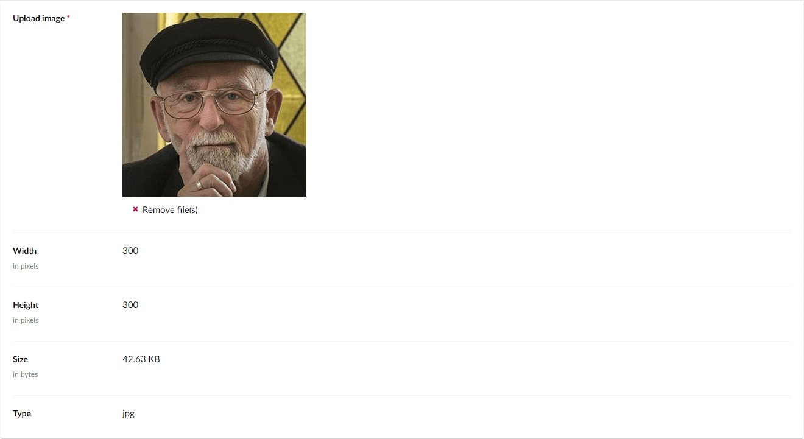

## Umbraco Contentment

### Bytes

Bytes is a drop-in replacement for Umbraco's "Label (bigint)" Data Type.

When you've uploaded an image to the Media section, have you wondered why the "Size" field displays such a long number?


Of course, it's the filesize of the image - in bytes. But how many kilobytes or megabytes is that?

The Bytes property-editor will make the filesize value human readable.


### How to configure the editor?

In your new Data Type, selected the "[Contentment] Bytes" option. You will see the following configuration fields.



The first field is **Kilobytes?**, this lets you define how many bytes are in a kilobyte - either `1000` or `1024`, (the default is `1024`).

> _Fun fact: In decimal, there are 1000 bytes in a kilobyte, whereas in binary, there are 1024 bytes. This is also know as a kibibyte._

The second field is **Decimal places**, used to set how many numbers are displayed after the decimal place. The default is `2`.

Next step is to add the Data Type to your Media Type (or Document Type, depending on how you want to use it).

The intended purpose for Bytes was to replace the "Size" property on the "File" or "Image" media-types, like so...




### How to use the editor?

Once you have added the configured Data Type to your Media Type, the bytes will be displayed.



This property-editor is a read-only label.


### How to get the value?

The value for Bytes is a `long` (i.e. `Int64`). To use this in your view templates, here are some examples.

Assuming that are using this as the "Size" property on the "Image" Media Type, then...

Using Umbraco's Models Builder...

```cshtml
@Model.UmbracoBytes
```

Without ModelsBuilder...

Weakly-typed...

```cshtml
@Model.Value("umbracoBytes")
```

Strongly-typed...

```cshtml
@Model.Value<long>("umbracoBytes")
```


### Further reading

- If you would like a .NET library to help byte size representation in code easier, check out [ByteSize by Omar Khudeira](https://github.com/omar/ByteSize).
  - [Omar is a fan of 1024 bytes in a kilobyte](https://omar.io/2017/01/16/when-technically-right-is-wrong-kilobytes.html). Here are some more opinions on the matter...
    - [Coding Horror (Jeff Atwood) - Gigabyte: Decimal vs. Binary](https://blog.codinghorror.com/gigabyte-decimal-vs-binary/)
    - [xkcd (Randall Munroe) #394 - Kilobyte](https://xkcd.com/394/)
    - [Stack Overflow - Really 1 KB (KiloByte) equals 1024 bytes?](https://stackoverflow.com/q/19819763/12787)
