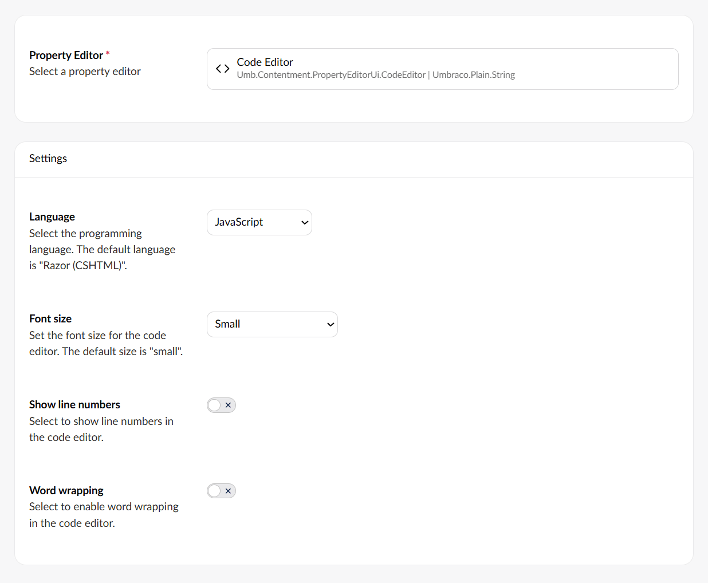
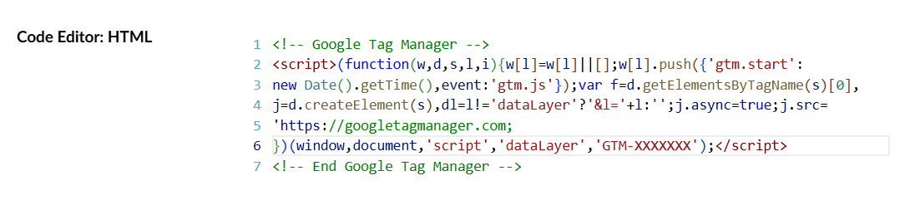

## Contentment for Umbraco

### Code Editor

Code Editor is a property-editor that is used to enter code snippets (as content), makes use of the [Prism Code Editor](https://github.com/jonpyt/prism-code-editor) library.

This is useful if you would like to embed a snippet of HTML or JavaScript on a content page, or have a full HTML property-editor.


### How to configure the editor?

In your new Data Type, selected the "[Contentment] Code Editor" option. You will see the following configuration fields.



The first field is **Language mode**, this is used to select the programming language mode, for code syntax highlighting. The default mode is "Razor", meaning that you can use a combination of HTML, CSS, JavaScript and Razor syntax.

The **Font size** field is used to set the font size, the value must be a [valid CSS font-size value](https://developer.mozilla.org/en-US/docs/Web/CSS/font-size), e.g. `14px`, `80%`, `0.8em`, etc. The default size is "`small`".

The **Word wrapping** option can enable the code editor to wrap the text around to the following line.


### How to use the editor?

Once you have added the configured Data Type to your Document Type, the Code Editor editor will be displayed on the content page's property panel.




### How to get the value?

The value for the Code Editor is a `string`.

Programmatically, you would access the value exactly the same as Umbraco's Textarea editor, [see Umbraco's documentation for code snippet examples](https://docs.umbraco.com/umbraco-cms/fundamentals/backoffice/property-editors/built-in-umbraco-property-editors/textarea#mvc-view-example).

If you are wanting to display the code content as a pre-formatted code snippet, I would recommend using the `<pre>` and `<code>` tags.

Using Umbraco's Models Builder...

```cshtml
<pre><code>@Html.Raw(Model.CodeEditor)</code></pre>
```

Without ModelsBuilder...

Weakly-typed...

```cshtml
<pre><code>@Html.Raw(Model.Value("codeEditor"))</code></pre>
```

Strongly-typed...

```cshtml
<pre><code>@Html.Raw(Model.Value<string>("codeEditor"))</code></pre>
```

For code syntax highlighting, the following JavaScript libraries are quite popular:

- [Prism.js](https://prismjs.com/)
- [highlight.js](https://highlightjs.org/)
