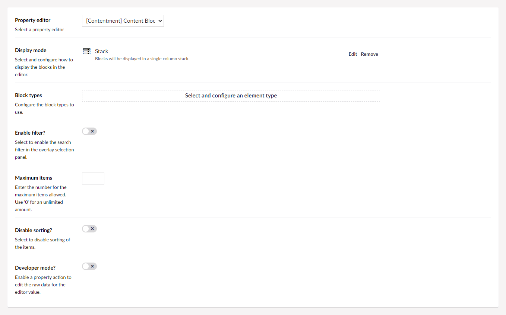
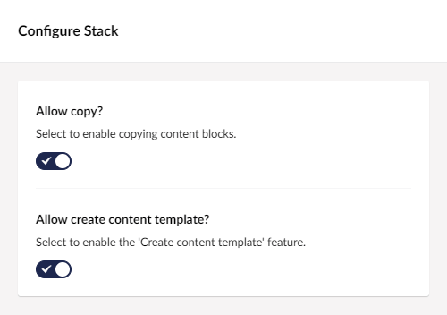
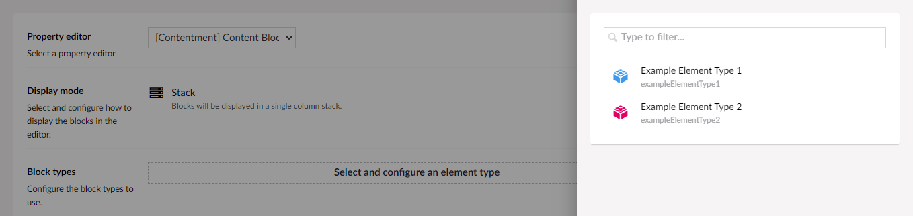
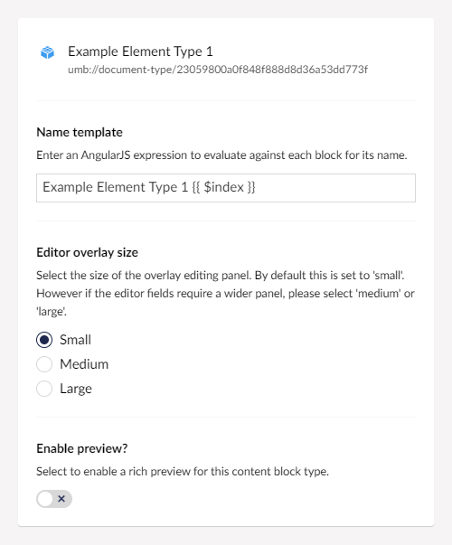
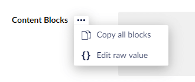
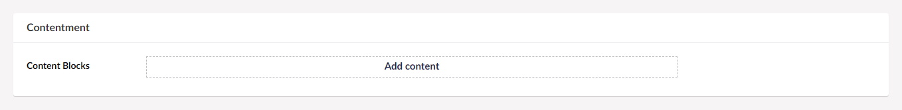
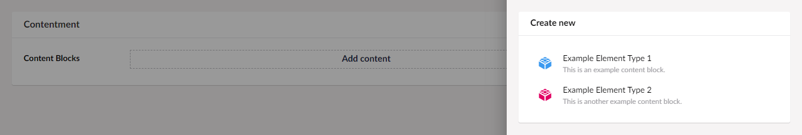
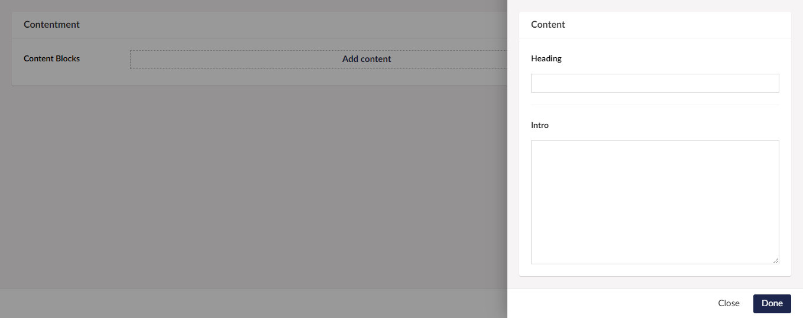
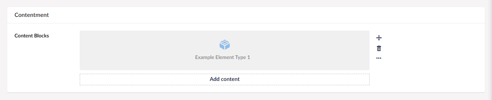
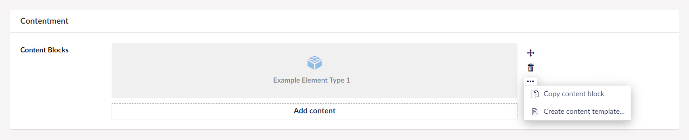

## Contentment for Umbraco

> This documentation is a _**work-in-progress.**_ There will be plot holes and missing pieces. Please bear with me.

### Content Blocks

Content Blocks is a property-editor used for creating a list of structured content, with each block configurable using an element type.

> If you are using Umbraco 8.7 (or above), this may sound familiar to the [Block List Editor](https://our.umbraco.com/Documentation/Getting-Started/Backoffice/Property-Editors/Built-in-Property-Editors/Block-List-Editor/), and you may be asking yourself why should you use Content Blocks over the built-in Block List Editor? It's a good question, and you'll find no marketing spin from me. So if you have any doubts, then I'd recommend that you stick with Umbraco's built-in editors. Content Blocks has subtle differences, it's entirely your choice.

> For long time fans of Umbraco v7.x, if you recall the [Stacked Content](https://our.umbraco.com/packages/backoffice-extensions/stacked-content) editor, then Content Blocks could be considered its spiritual successor.


### How to configure the editor?

In your new Data Type, selected the "[Contentment] Content Blocks" option. You will see the following configuration fields.

The two main fields are "**Display mode**" and "**Block types**", the rest are for further configuration.



The **Display mode** is pre-configured to use the **Stack** mode, this enables a richer editing experience. Alternatively, if you prefer to use an interface similar to Umbraco's Content Picker editor, you can remove the **Stack** configuration and use the **List** mode instead. Each display mode comes with their own configuration options, _e.g. the Stack mode has a feature to create a **Content template** from each block item._



> **Note:** You can add your own custom display modes by implementing the [`IContentBlocksDisplayMode`](https://github.com/leekelleher/umbraco-contentment/blob/develop/src/Umbraco.Community.Contentment/DataEditors/ContentBlocks/IContentBlocksDisplayMode.cs) interface.
> 
> `// TODO: Write documentation on developing custom display modes.`

Next is to select and configure the **Block types**. By pressing the **Select and configure an element type** button, you will be presented with a selection of element types.

> **Note:** If you have not created any element types. Please refer to [Umbraco's documentation on how to create an element type](https://our.umbraco.com/documentation/Getting-Started/Data/Defining-content/).



Once you have selected an element type, you will be presented with the configuration options for that block type.



The **Name template**  field can be used to enter an AngularJS expression, which is evaluated against each block (of this type) to display its name. If this field is left empty, the default name template will be `"Item {{ $index }}"`.

The **Editor overlay size** option will configure the size (width) of the overlay editing panel. The options are Small, Medium and Large. The default value is "Small", this is typically ideal for concise element types, e.g. with a heading, media picker and intro blurb textarea. For element types with heavier content, e.g. Rich Text editors, then "Medium" or "Large" would be a more suitable option.

The **Enable preview?** option can be enabled to render a richer preview of the content block item. The preview mechanism uses a Razor (`.cshtml`) partial-view for rendering.

> **Note:** For details on how to render a preview, see the [Previews](#previews) section below.

Once you have configured the block type, press the **Done** button at the bottom of the overlay.

The rest of the configuration options can give finer control over the editing experience.

The **Enable filter?** option can enable a search filer at the top of the overlay selection panel. This can be useful if you have configured many block types.

The **Maximum items** field is used to limit the number of content blocks that the editor can have. Once the maximum is reached, the **Add** button will not be available.

The **Disable sorting?** option will prevent the Content Blocks from being sorted.

Lastly, the **Developer mode?** option is a special feature for those who would like to have access to the raw JSON value of the Content Block editor. Enabling this option will add a [property action](https://our.umbraco.com/Documentation/Extending/Property-Editors/Property-Actions/) called **Edit raw value**.



Once you have configured the Data Type, press the **Save** button and add it to your Document Type.


### How to use the editor?

Once you have added the configured Data Type on your Document Type, the Content Blocks editor will be displayed on the content page's property panel.



By pressing the **Add content** button, an overlay with the available content blocks will appear.



Selecting one of the available content blocks, you will be presented with the editing panel, (with the properties from the corresponding Element Type).



Once you have finished editing the properties, press the **Done** button at the bottom of the overlay. This will close the overlay, with the content block being added to the stack/list.



For further options, each content block has its own action menu, initially for sorting and removing content, but additional features for **Copy content block**, and **Create content template...** actions.




#### Previews

An advanced feature of Content Blocks is the ability to have a richer preview for each block item. To do this, make sure that you enable the **Enable preview?** option when you configure the content block.

> **Note:** The preview feature will only work with the **Stack** display mode.

Once the preview feature is enabled, the content block item will render the preview using a Razor partial-view template.

The default preview partial-view (that ships with Contentment), will be used. This can be found at [`"~/App_Plugins/Contentment/render/ContentBlockPreview.cshtml"`](https://github.com/leekelleher/umbraco-contentment/blob/develop/src/Umbraco.Community.Contentment/DataEditors/ContentBlocks/ContentBlockPreview.cshtml). This will render similar to the default (plain) block style, with the exception that the **Name template** value is not available, the content block item's GUID (key) will be displayed instead.

To use your own custom preview partial-views, you must use the following convention; name the partial-view the same as the Element Type alias, and place it in **the `"~/Views/Partials/Blocks/"` folder.** If you would like to re-use the same preview partial-view for multiple content block items, you can create a `"~/Views/Partials/Blocks/Default.cshtml"` template.

When developing your own preview partial-view template, the declaration can be one of the following...

- `@inherits Umbraco.Web.Mvc.ContentBlockPreviewView`
  This is the default declaration. This will give you access to `@Model.Content` (the current page as `IPublishedContent`), and `@Model.Element` (the content block item as `IPublishedElement`).

- `@inherits ContentBlockPreviewModel<TPublishedContent, TPublishedElement>`
  This is advanced syntax, _(note, may require some trial-and-error, and sense of play)._ This can be used if you are using Umbraco's ModelsBuilder feature, where you know the object-type of the current Content Type page and Element Type item. As above, you can have strongly-typed access to the current page with `@Model.Content`, and the content block item with `@Model.Element`.

To aid the preview, there are a number of additional properties available in the partial-view's `ViewData` dictionary.

- `ViewData["elementIndex"]` - This is the index (`int`) of the content block item's position in the list.
- `ViewData["elementIcon"]` - This is the Element Type's icon, _(since the icon is not available on `Model.Element.ContentType`)._
- `ViewData["contentIcon"]` - This is the Content Type's icon, _(since the icon is not available on `Model.Content.ContentType`)._

> **Note:** The preview feature **does not work** on a freshly created new unsaved page. This is because the preview has no context of the page itself.


### How to get the value?

The value for the Content Blocks will be as `IEnumerable<IPublishedElement>` object-type.

If you are using Umbraco's ModelsBuilder feature, then each content block item will be castable as the intended Element Type model.

In terms of rendering the items, you can do so however you desire. As an example here, I would recommend having a separate partial-view template for each of the Element Types, (using the Element Type's alias as the filename), that way you are able to encapsulate the logic for that particular Element Type.

Using Umbraco's Models Builder...

```cshtml
<div>
    @foreach (var item in Model.ContentBlocks)
    {
        @Html.Partial(item.ContentType.Alias, item)
    }
</div>
```

Without ModelsBuilder...

The weakly-typed API may give you some headaches, we suggest using strongly-typed, (or preferably Models Builder).

Here's an example of strongly-typed...

```cshtml
<div>
    @foreach (var item in @(Model.Value<IEnumerable<IPublishedElement>>("contentBlocks")))
    {
        @Html.Partial(item.ContentType.Alias, item)
    }
</ul>
```


### Similar editors and further reading

There are several alternative block-based editors that you could use with Umbraco v8, here are a selection...

- [Umbraco's **Block List** editor](https://our.umbraco.com/documentation/getting-started/backoffice/property-editors/built-in-property-editors/Block-List-Editor/) - available since Umbraco v8.7.0.
- [Umbraco's **Nested Content** editor](https://our.umbraco.com/documentation/getting-started/backoffice/property-editors/built-in-property-editors/Nested-Content/) - available since Umbraco v7.7.0, _(since superseded by the Block List editor)._
- [**Bento** editor by KOBEN Digital](https://our.umbraco.com/packages/backoffice-extensions/bento-editor/) - compatible with Umbraco v8.6.0 (and above).
- [**Perplex.ContentBlocks** by Perplex](https://our.umbraco.com/packages/backoffice-extensions/perplexcontentblocks/) - _(ignore my naming clash with Content Blocks, naming things is hard),_ compatible with Umbraco v8.1.0 (and above).

For further reading, here are a selection of insights...

- [Paul Marden's **Landing Page article** on Skrift](https://skrift.io/issues/part-1-landing-pages/) - part of a wider series on exploring common practices.
- [Cogworks' post on **How to Pick a Block Style Editor**](https://www.wearecogworks.com/blog/umbraco-v8-how-to-pick-a-block-style-editor/)
