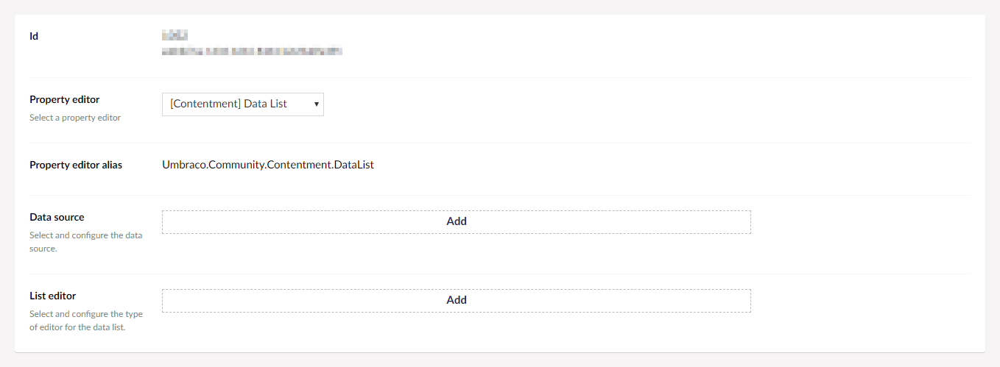
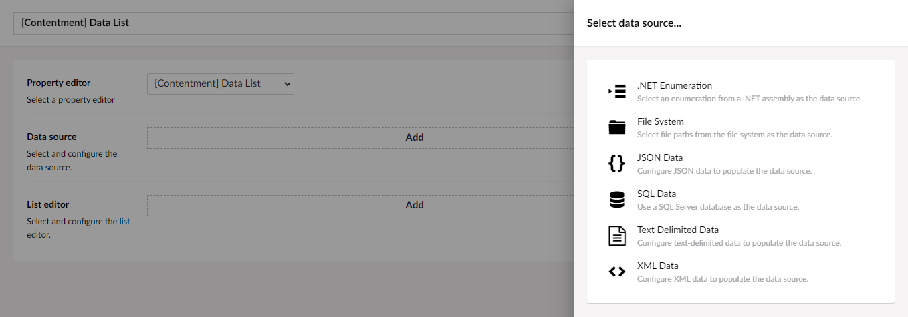
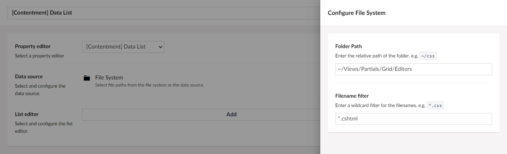
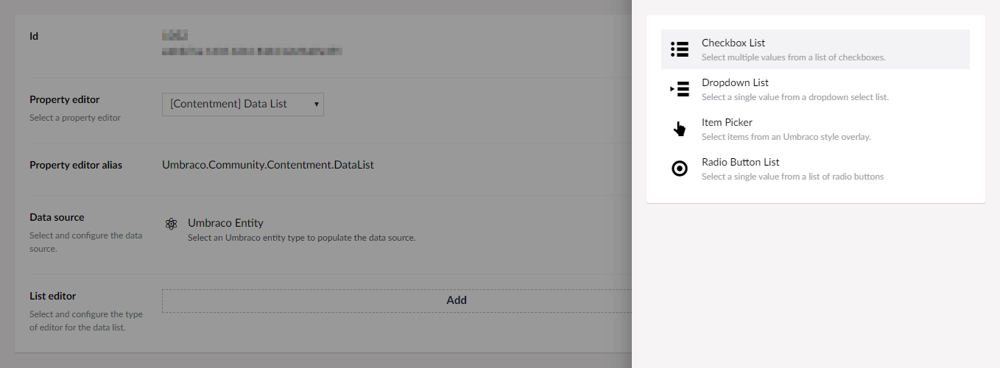
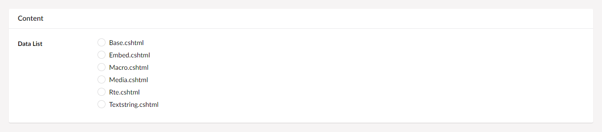
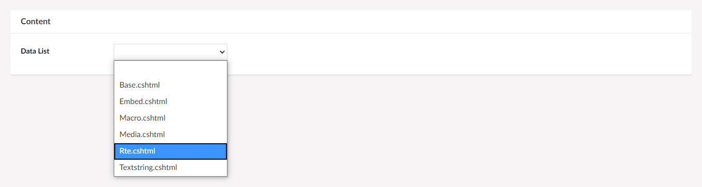
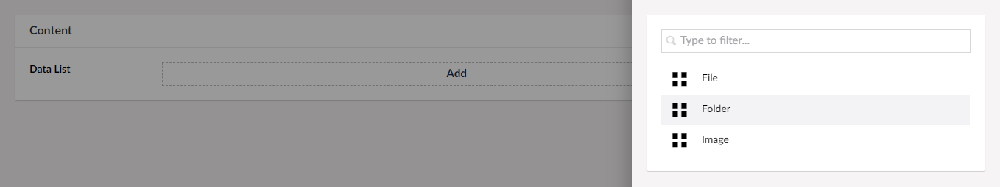
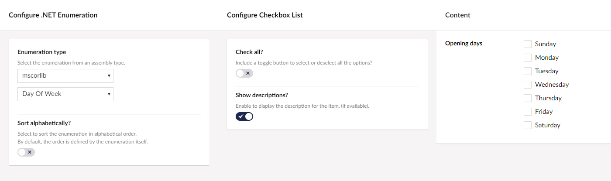

## Umbraco Contentment

### Data List

Data List is a property-editor that takes a data source and makes the values selectable in a list editor control.

_If that sounds too generic, think of it like this... take a data source, say a SQL query, and display the results in an editor, say a dropdown-list, or checkbox-list, or whatever!_

> This property-editor has taken inspiration from the community package, [nuPickers](https://our.umbraco.com/packages/backoffice-extensions/nupickers/) by Hendy Racher, _(itself inspired by [a uComponents idea](https://gist.github.com/leekelleher/6183524))._


### How to configure the editor?

[A few sentences about the configuration editor + screenshots]

In your new Data Type, selected the "[Contentment] Data List" option. You will see the following configuration fields.



The two main fields are "**Data source**" and "**List editor**".

Selecting the **Data source**, you will be presented with a selection of data sources, including .NET enumeration, file system, SQL, Umbraco entities, XML data.



For our example, let's choose **Umbraco Entity**. You will then be presented with the configuration options for this data source.



Once you have configured the data source, press the **Done** button at the bottom of the overlay.

Next is to select and configure the **List editor**. You will be presented with a selection of options.



For our example, let's choose **Checkbox List**. You will then be able to configure the editor options.


Once you have configured both the **Data source** and **List editor** you can **Save** the Data Type and add it to your Document Type.


### How to use the editor?

[A few sentences about how to use the editor itself + screenshots]

Once you have added the configured Data Type to your Document Type, the notes will be displayed on the content page's property panel.


The beauty of the **Data List** property-editor is that all the list editors are hot-swappable. Meaning that you wanted to use a **Radiobutton List** instead, no problem.



or a **Dropdown List**?



or an **Item Picker**? _(This list editor is visually similar to Umbraco's Content Picker editor.)_




### How to get the value?

The value for the Data List is an `IEnumerable<string>`, _(regardless of whether it's a single value or multiple values)._

To use this in your view templates, here are some examples.

For our example, we'll assume that your property's alias is `"dataList"`, then...

Using Umbraco's Models Builder...

```cshtml
<ul>
    @foreach (var item in Model.DataList)
    {
        <li>@item</li>
    }
</ul>
```

Without ModelsBuilder...

The weakly-typed API may give you some headaches, we suggest using strongly-typed, (or preferably Models Builder).

Here's an example of strongly-typed...

```cshtml
<ul>
    @foreach (var item in @(Model.Value<string>("dataList")))
    {
        <li>@item</li>
    }
</ul>
```


### Suggestions and ideas

Inspiration for how a Data List could be used...

#### Days of the week

Say you wanted to specify a business's opening days.

You could use the [`System.DayOfWeek`](https://docs.microsoft.com/en-us/dotnet/api/system.dayofweek) enum with a checkbox list to display the days of the week.

For the **Data source**, select **.NET Enumeration**. For the **Enumeration type**, select "mscorlib", then select "Day Of Week" option.

For the **List editor**, select the **Checkbox List** option.




#### Country picker

Say you wanted to select from a list of countries. You could use a third-party XML data source.

For the **Data source**, select **XML Data**.

- For the **URL**, enter "https://madskristensen.net/posts/files/countries.xml"
- For the **Items XPath**, enter "/countries/country"
- For the **Name XPath**, enter "text()"
- For the **Value XPath**, enter "@code"

For the **List editor**, select **Item Picker**, _maybe configure it with a nice Globe icon in blue?)_


