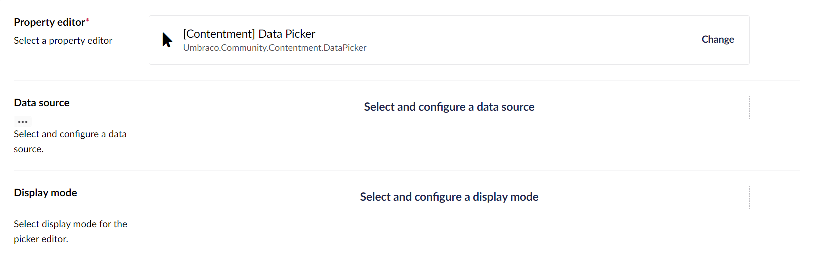
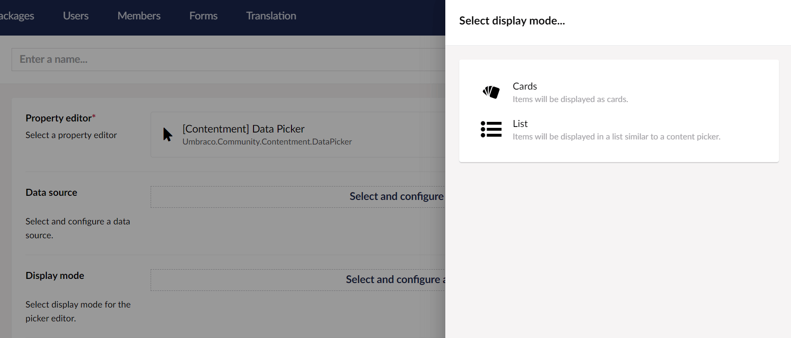
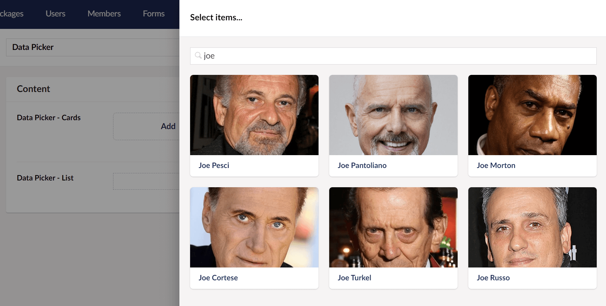
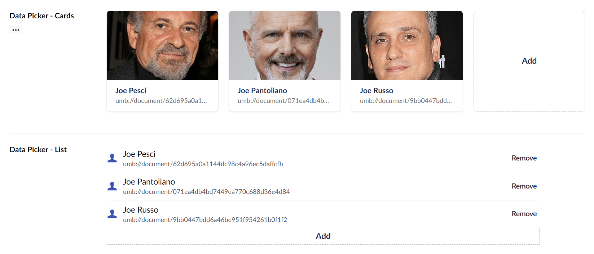

## Contentment for Umbraco

### Data Picker

Data Picker is a picker for larger queryable data-sources; for scenarios where [Data List](data-list.md) has its limitations with filterying and pagination.


### How to configure the editor?

In your new Data Type, selected the "[Contentment] Data Picker" option. You will see the following configuration fields.

The two main fields are "**Data source**" and "**Display mode**".



Selecting the **Data source**, you will be presented with a selection of data sources, including .NET enumeration and Umbraco for content and members data.

> Please note, if you are looking for an editor to use with a smaller dataset, you can consider the Data List editor, [see the list of available **data-sources** for Data List](../data-sources/README.md).

Once you have configured the data source, press the **Done** button at the bottom of the overlay.

Next is to select and configure the **Display mode**. You will be presented with a selection of editor UI options.



Once you have configured both the **Data source** and **Display mode**, you can configure the rest of the fields.

The **Page size** field is used to set how many items to display per page in the overlay panel.

The **Editor overlay size** is to set the width of the overlay panel; small, medium or large.

The **Maximum items** field is used to limit the number of items that can be picked. Once the maximum is reached, the **Add** button will not be available.

Lastly, the **Developer mode?** option is a special feature for those who would like to have access to the raw JSON value of the Data Picker editor. Enabling this option will add a [property action](https://our.umbraco.com/Documentation/Extending/Property-Editors/Property-Actions/) called **Edit raw value**.

When you are happy with the configuration, you can **Save** the Data Type and add it to your Document Type.


### How to use the editor?

Once you have added the configured Data Type on your Document Type, the Data Picker editor will be displayed on the content page's property panel.

The editor will initially appear empty, by pressing the **Add item** button, an overlay with the available items from your configured data source will appear.



You can select multiple items, then once you are happy with your selection, press the **Select** button and these will be added to your list.




### How to extend this with my own stuff?

You can extend Data Picker with your own custom data sources and display modes.


#### Extending with your own custom data source

For creating your own custom data source, you will need to create a new C# class that implements the [`Umbraco.Community.Contentment.DataEditors.IDataPickerSource`](https://github.com/leekelleher/umbraco-contentment/blob/dev/v6.x/src/Umbraco.Community.Contentment/DataEditors/DataPicker/IDataPickerSource.cs) interface.

This interface contains two methods;

1. `GetItemsAsync(config, values)`, which must return a `Task<IEnumerable<DataListItem>>` object type.
2. `SearchAsync(config, pageNumber, pageSize, query)`, which must return a `Task<PagedViewModel<DataListItem>>` object type.

The `DataListItem` model is made up of four `string` properties: `Name`, `Value`, `Description` _(optional)_ and `Icon` _(optional)_.

```csharp
using Umbraco.Cms.Core.Models;
using Umbraco.Cms.Core.PropertyEditors;
using Umbraco.Community.Contentment.DataEditors;

namespace CodeExample;

public class EventDataSource : IDataPickerSource
{
    private readonly IEventService _eventService;

    public EventDataSource(IEventService eventService)
    {
        _eventService = eventService;
    }

    public string Name => "Events";
    public string Description => "List of events";
    public string Icon => "icon-movie-alt";
    public Dictionary<string, object>? DefaultValues => default;
    public IEnumerable<ConfigurationField>? Fields => default;
    public string Group => "Custom datasources";
    public OverlaySize OverlaySize => OverlaySize.Small;

    public async Task<IEnumerable<DataListItem>> GetItemsAsync(
        Dictionary<string, object> config,
        IEnumerable<string> values
    )
    {
        var events = (await _eventService.GetEventsAsync()).ToList();

        if (events.Count == 0)
        {
             return Task.FromResult(Enumerable.Empty<DataListItem>());
        }

        var items = new List<DataListItem>();

        foreach (var eventItem in events)
        {
            items.Add(new DataListItem { Name = eventItem.Name, Value = eventItem.Id.ToString() });
        }

        var results = items.OrderBy(x => x.Name);

        return Task.FromResult(results);
    }

    public async Task<PagedViewModel<DataListItem>> SearchAsync(
        Dictionary<string, object> config,
        int pageNumber = 1,
        int pageSize = 12,
        string query = ""
    )
    {
        var events = await _eventService.SearchEventsAsync(query, null, null, null, null);

        if (!events.Events.Any())
        {
            return Task.FromResult(PagedViewModel<DataListItem>.Empty());
        }

        var items = new List<DataListItem>();
        var offset = (pageNumber - 1) * pageSize;

        foreach (var eventItem in events.Events.Skip(offset).Take(pageSize))
        {
            items.Add(new DataListItem
            {
                Name = eventItem.Name,
                Value = eventItem.Id.ToString(),
                Icon = "icon-movie-alt"
            });
        }

        var results = new PagedViewModel<DataListItem>
        {
            Items = items,
            Total = pageSize > 0 ? (long)Math.Ceiling(events.EventCount / (decimal)pageSize) : 1,
        };

        return Task.FromResult(results);
    }
}
```


##### Accessing contextual content

See Data List's documentation for [**Accessing contextual content**](https://github.com/leekelleher/umbraco-contentment/blob/dev/v6.x/docs/editors/data-list.md#accessing-contextual-content).


#### Providing custom values for published content models

See Data List's documentation for [**Providing custom values for published content models**](https://github.com/leekelleher/umbraco-contentment/blob/dev/v6.x/docs/editors/data-list.md#providing-custom-values-for-published-content-models).


#### Extending with your own custom display modes

For creating your own custom data source, you will need to create a new C# class that implements the [`Umbraco.Community.Contentment.DataEditors.IContentmentDisplayMode`](https://github.com/leekelleher/umbraco-contentment/blob/dev/v6.x/src/Umbraco.Community.Contentment/DataEditors/_/IContentmentDisplayMode.cs) interface.

> `// TODO: Write documentation on developing custom display modes.`


### How to get the value?

Depending on how the selected data source is configured, the value will either be a `string` or a custom object-type, e.g. for Umbraco Content this would be an `IPublishedContent` object.

To use this in your view templates, here are some examples.

For our example, we'll assume that your property's alias is `"dataPicker"`, then...

Using Umbraco's Models Builder...

```cshtml
<ul>
    @foreach (var item in Model.DataPicker)
    {
        <li>@item</li>
    }
</ul>
```

Without ModelsBuilder...

The weakly-typed API may give you some headaches, we suggest using strongly-typed, (or preferably Models Builder).

Here's an example of strongly-typed...

```cshtml
<ul>
    @foreach (var item in Model.Value<IEnumerable<string>>("dataPicker"))
    {
        <li>@item</li>
    }
</ul>
```

