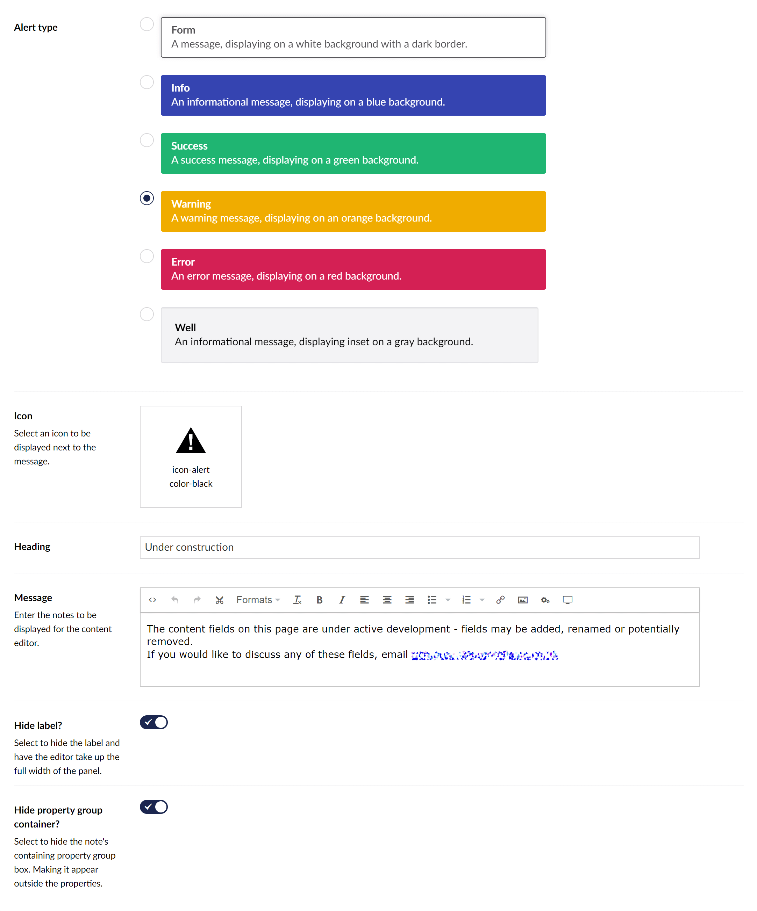
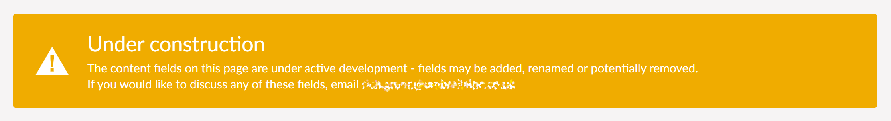

## Contentment for Umbraco

### Editor Notes

Editor Notes is a property-editor that can be used to display rich-text instructional messages for content editors.

> This property-editor has evolved from the [Notes](notes.md) editor, which itself takes inspiration from community packages, such as [uEditorNotes](https://our.umbraco.com/packages/backoffice-extensions/ueditornotes/) by Marc Goodson and [uComponents Notes](http://ucomponents.github.io/data-types/notes/) by Matt Brailsford.

### How to configure the editor?

In your new Data Type, selected the "[Contentment] Editor Notes" option. You will see the following configuration fields.

The initial field is to select an **Alert type**, the available options are: `Form`, `Info`, `Success`, `Warning`, `Error` and `Well`.

The next field is **Icon**, this will open Umbraco's icon picker overlay. Text filters and color selection can be used.

The next 2 fields are for **Heading** and **Message**, these are the main contents of the editor note.

> _Fun fact: The rich-text editor uses Umbraco's TinyMCE integration, meaning that you can link to Umbraco content and embed Umbraco media._

There are also options to **hide the label** on the property itself, and to **hide the property group container**. Selecting these option will enable the notes to be displayed in full width and outside of the content property panel.

### How to use the editor?

Once you have added the configured Data Type on your Document Type, the notes will be displayed on the content page's property panel.

### How to get the value?

This property-editor is read-only and does not store any value against the property.

### Further reading

If you are interesting in making your Umbraco back-office super friendly. Here are some articles for further inspiration...

- [Friendly Backoffice](https://24days.in/umbraco-cms/2016/friendly-backoffice/) - Janae Cram's 24 Days In Umbraco article.
- [10 tips to make your editor love you](https://www.perplex.nl/10-tips) - Fedosja van der Lee's presentation from CodeGarden 19.
