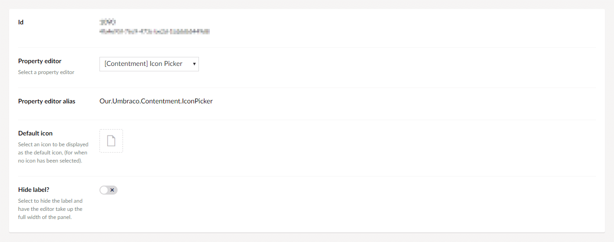
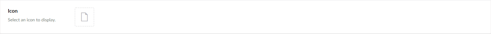
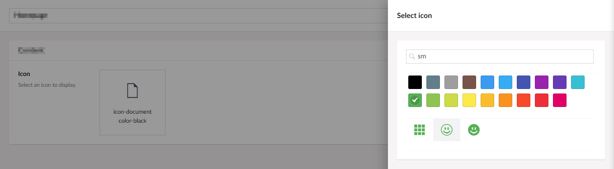
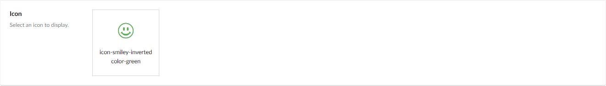

## Umbraco Contentment

### Icon Picker

Icon Picker is a property-editor that is used to pick a single icon from Umbraco's default icon set.


### How to configure the editor?

In your new Data Type, selected the "[Contentment] Icon Picker" option. You will see the following configuration fields.



The main field is **Default icon**, with this you can define the default icon for the property.


### How to use the editor?

Once you have added the configured Data Type to your Document Type, the Icon Picker editor will be displayed on the content page's property panel.



By clicking on the icon box, will open Umbraco's icon picker overlay. Text filters and color selection can also be used.



Having picked your icon, the selected icon will be displayed in the icon box.




### How to get the value?

The value for the Icon Picker is a `string` in the form of `"icon-{name} color-{name}"` (e.g. `"icon-hat color-black"`). To use this in your view templates, here are some examples.

Assuming that your property's alias is `"icon"`, then...

Using Umbraco's Models Builder...

```cshtml
<i class="icon @Model.Icon"></i>
```

Without ModelsBuilder...

Weakly-typed...

```cshtml
<i class="icon @Model.Value("icon")"></i>
```

Strongly-typed...

```cshtml
<i class="icon @(Model.Value<string>("icon"))"></i>
```


### How to configure as a parameter-editor?

Icon Picker is available as a macro parameter-editor by default. It will automatically be listed in the parameter options for your macros.


### Further reading

For a list of available icons in Umbraco, [Nic Bell's UCreate project has a page for them](https://nicbell.github.io/ucreate/icons.html).
