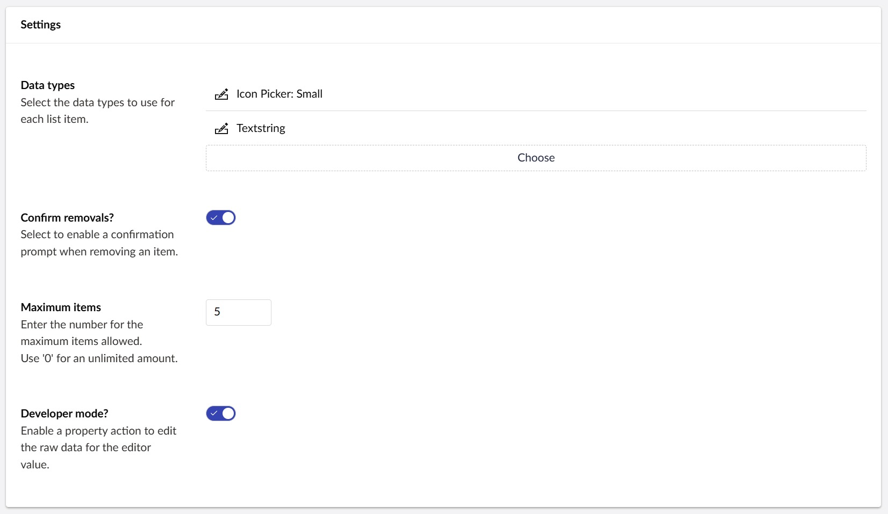
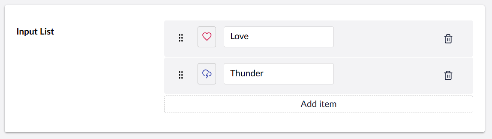

## Contentment for Umbraco

### Input List

List Items is a property-editor that is configured with a one or more data-types to be used in a repeatable list.


### How to configure the editor?

In your new Data Type, select the "[Contentment] Input List" option. You will see the following configuration fields.



The main field is **Data types**: use this to select the data-types you would like to use for each item row.

The **Confirm removals?** option will enable a confirmation prompt for when removing an item row.

The **Maximum items** field is used to limit the number of content blocks that the editor can have. Once the maximum is reached, the **Add** button will not be available.

Lastly, the **Developer mode?** option is a special feature for those who would like to have access to the raw JSON value of the List Items editor. Enabling this option will add a [property action](https://docs.umbraco.com/umbraco-cms/customizing/property-editors/property-actions) called **Edit raw value**.


When you are happy with the configuration, you can **Save** the Data Type and add it to your Document Type.


### How to use the editor?

Once you have added the configured Data Type on your Document Type, the Input List editor will be displayed on the content page's property panel.

The editor will initially appear empty, by pressing the **Add item** button, a fieldset for an item value will appear.




### How to get the value?

The value for the Input List will be a `IEnumerable<IEnumerable<object>>` object-type, e.g. an array of array of object values.

To use this in your view templates, here are some examples.

For our example, we'll assume that your property's alias is `"inputList"`, then...

Using Umbraco's Models Builder...

```cshtml
<ul>
    @foreach (var item in Model.InputList)
    {
        <li>
            @foreach(var value in item)
            {
                <span>@value</span>
            }
        </li>
    }
</ul>
```

Without ModelsBuilder...

The weakly-typed API may give you some headaches, I suggest using strongly-typed, (or preferably Models Builder).

Here's an example of strongly-typed...

```cshtml
<ul>
     @{
        var inputList = Model.Value<IEnumerable<IEnumerable<object>>>("inputList");
        foreach (var item in inputList)
        {
            <li>
                @foreach(var value in item)
                {
                    <span>@value</span>
                }
            </li>
        }
    }
</ul>
```

