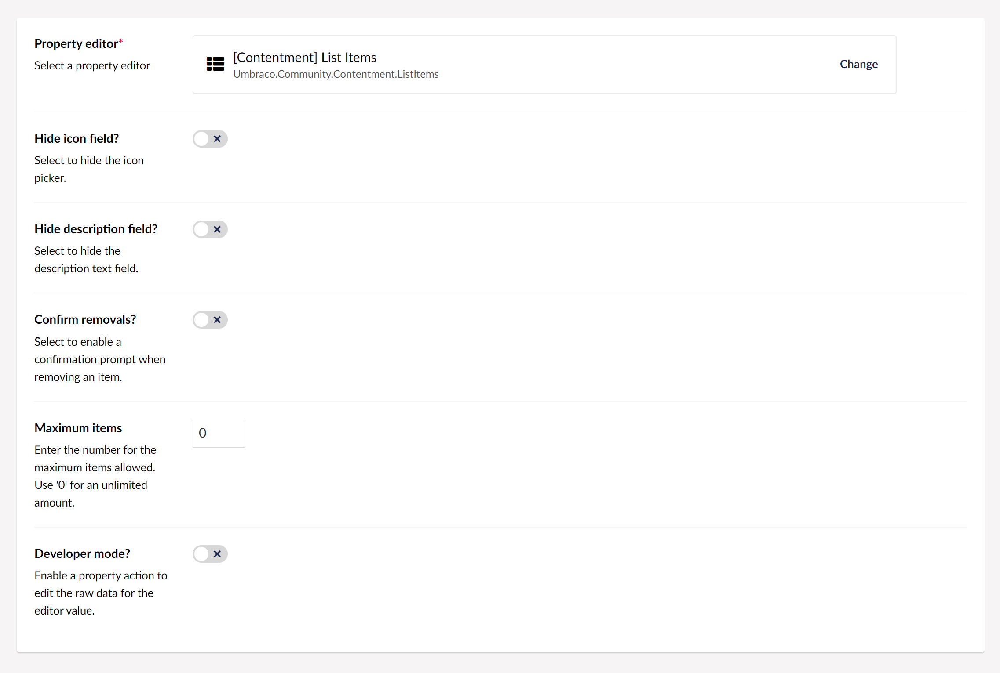
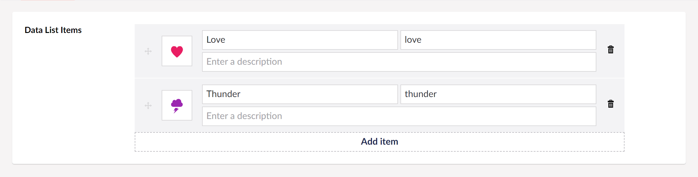

## Contentment for Umbraco

### List Items

List Items is a property-editor to manage item values, (primarily to support the Data List editor with Umbraco Content Property Values data-source).


### How to configure the editor?

In your new Data Type, selected the "[Contentment] List Items" option. You will see the following configuration fields.



The first two fields are **Hide icon field?** and ** Hide description field?**, these are to toggle the visibility, if you would like to streamline the editor for name and value fields only.

The **Confirm removals?** option will enable a confirmation prompt for when removing a social link item.

The **Maximum items** field is used to limit the number of content blocks that the editor can have. Once the maximum is reached, the **Add** button will not be available.

Lastly, the **Developer mode?** option is a special feature for those who would like to have access to the raw JSON value of the List Items editor. Enabling this option will add a [property action](https://our.umbraco.com/Documentation/Extending/Property-Editors/Property-Actions/) called **Edit raw value**.

When you are happy with the configuration, you can **Save** the Data Type and add it to your Document Type.


### How to use the editor?

Once you have added the configured Data Type on your Document Type, the List Items editor will be displayed on the content page's property panel.

The editor will initially appear empty, by pressing the **Add item** button, a fieldset for a item value will appear.




### How to get the value?

The value for the List Items will be a [`IEnumerable<DataListItem>`](https://github.com/leekelleher/umbraco-contentment/blob/develop/src/Umbraco.Community.Contentment/DataEditors/DataList/DataListItem.cs) object-type.

To use this in your view templates, here are some examples.

For our example, we'll assume that your property's alias is `"listItems"`, then...

Using Umbraco's Models Builder...

```cshtml
<ul>
    @foreach (var item in Model.ListItems)
    {
        <li id="@item.Value">@item.Name</li>
    }
</ul>
```

Without ModelsBuilder...

The weakly-typed API may give you some headaches, I suggest using strongly-typed, (or preferably Models Builder).

Here's an example of strongly-typed...

```cshtml
<ul>
     @{
        var listItems = Model.Value<IEnumerable<DataListItem>>("listItems");
        foreach (var item in listItems)
        {
            <li id="@item.Value">@item.Name</li>
        }
    }
</ul>
```

#### What about icons on the front-end?

Although this editor was not initially intended to be used on the frontend, _(as mentioned above, it was designed to support the Data List editor with Umbraco Content Property Values data-source),_ you are totally free to use it however you want. When it comes to displaying Umbraco's icons on the frontend, I'll leave that to your own frontend development skills.
