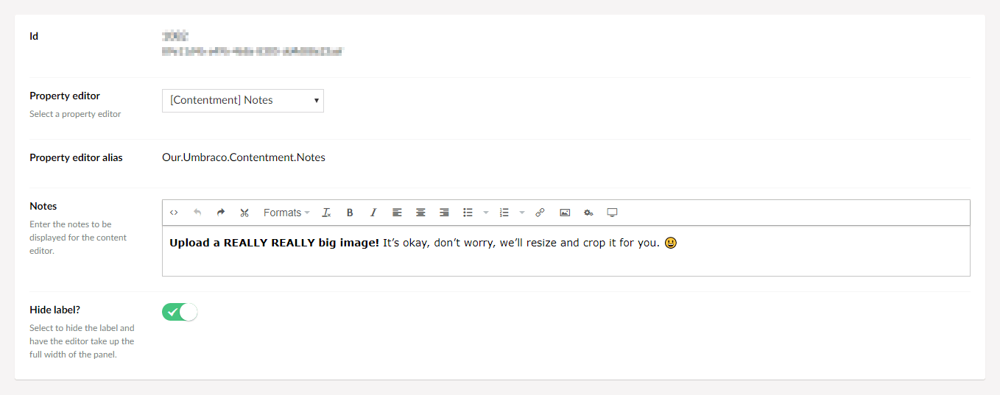

## Umbraco Contentment

### Notes

Notes is a property-editor that can be used to display rich-text instructional messages for content editors.

> This property-editor has taken inspiration from the community package, [uEditorNotes](https://our.umbraco.com/packages/backoffice-extensions/ueditornotes/) by Marc Goodson (and its predecessor [uComponents Notes](http://ucomponents.github.io/data-types/notes/) by Matt Brailsford).
> 
> If you are looking for further configuration options, _such as making the notes collapsible or displayed within a sliding panel_, then I'd heartily recommend using the [uEditorNotes](https://our.umbraco.com/packages/backoffice-extensions/ueditornotes/) package!

### How to configure the editor?

In your new Data Type, selected the "[Contentment] Notes" option. You will see the following configuration fields.

The main field is "**Notes**", here you can enter any instructional messages using the rich-text editor.

> _Fun fact: The rich-text editor uses Umbraco's TinyMCE integration, meaning that you can link to Umbraco content and embed Umbraco media._

There is also an option to **hide the label** on the property itself. Selecting this option will enable the notes to be displayed in full width of the content property panel.

### How to use the editor?

Once you have added the configured Data Type on your Document Type, the notes will be displayed on the content page's property panel.

### How to get the value?

This property-editor is read-only and does not store any value against the property.

### Further reading

If you are interesting in making your Umbraco back-office super friendly. Here are some articles for further inspiration...

- [Friendly Backoffice](https://24days.in/umbraco-cms/2016/friendly-backoffice/) - Janae Cram's 24 Days In Umbraco article.
- [10 tips to make your editor love you](https://www.perplex.nl/10-tips) - Fedosja van der Lee's presentation from CodeGarden 19.
