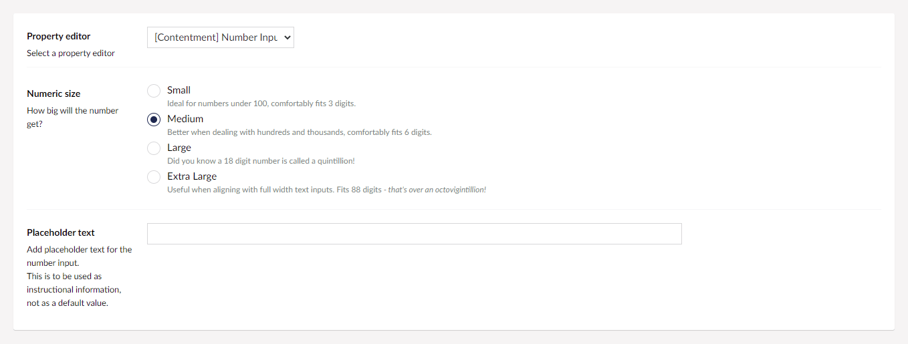
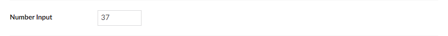

## Contentment for Umbraco

### Number Input

Number Input is a property-editor that is used to enter a numeric value.

### How to configure the editor?

In your new Data Type, selected the "[Contentment] Text Input" option. You will see the following configuration fields.

The first field is **Numeric size**, this is used to determine how big the number will get for the input. The size ranges from small, to extra large.

The next field is **Placeholder text**, which is used to add initial instructional information for the number input, this is not a default value.

> For technical users, from a HTML5 perspective, this is the [`<input>`'s `placeholder` attribute](https://developer.mozilla.org/en-US/docs/Web/HTML/Element/input/number#placeholder).

### How to use the editor?

Once you have added the configured Data Type to your Document Type, the Number Input editor will be displayed on the content page's property panel.

### How to get the value?

The value for the Text Input is an `int` (integer).

Programmatically, you would access the value exactly the same as Umbraco's Numeric editor, [see Umbraco's documentation for code snippet examples](https://our.umbraco.com/Documentation/Getting-Started/Backoffice/Property-Editors/Built-in-Property-Editors/Numeric/#mvc-view-examples).

### Further reading

- [Umbraco documentation on built-in property editor **Numeric**](https://our.umbraco.com/Documentation/Getting-Started/Backoffice/Property-Editors/Built-in-Property-Editors/Numeric/)
- [MDN Web documentation on `<input type="number">` element](https://developer.mozilla.org/en-US/docs/Web/HTML/Element/input/number)

