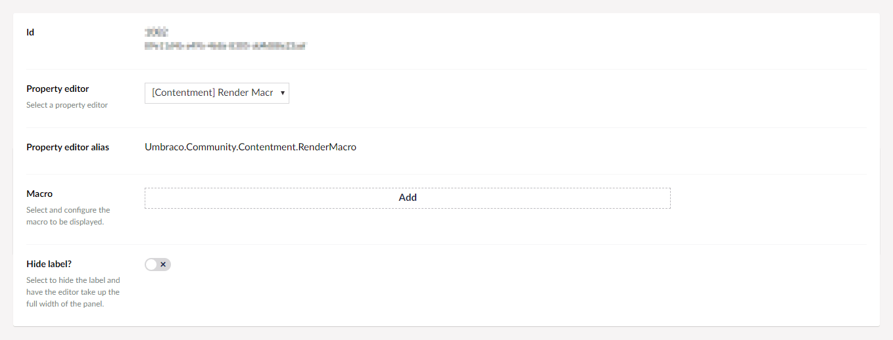

## Umbraco Contentment

**What is a Macro?**

If you are not sure what a Macro is, (within an Umbraco context), please read the documentation on the Umbraco community website.

- [Our Umbraco - Documentation - Templating - Macros](https://our.umbraco.com/documentation/reference/templating/macros/)

### Render Macro

Umbraco Macros are typically used for functionality on frontend of a website. But what if we could render them within the CMS back-office?

Render Macro is a read-only property-editor to display the HTML output from a Macro template.

> This property-editor has taken inspiration from the community package, [uComponents RenderMacro](http://ucomponents.github.io/data-types/render-macro/) by Lee Kelleher.

Similar to the [Notes](notes.md) property-editor, Render Macro can be used to display rich-text instructional messages for content editors.

### How to configure the editor?

In your new Data Type, selected the "[Contentment] Render Macro" option. You will see the following configuration fields.

The main field is "**Macro**", here you can select and configure the Macro to be rendered.

There is also an option to **hide the label** on the property itself. Selecting this option will enable the rendered macro to be displayed in full width of the content property panel.

### How to use the editor?

Once you have added the configured Data Type to your Document Type, the rendered macro will be displayed on the content page's property panel.

### How to get the value?

This property-editor is read-only and does not store any value against the property.

### Advanced usage

Render Macro offers a selection of special aliases that can be use to access meta-data from the property itself.

By adding any of the following aliases to your Macro parameters, they will be populated...

- `"__propertyAlias"` will be populated with the property's alias.
- `"__propertyLabel"` will be populated with the property's label (name).
- `"__propertyCulture"` will be populated with the currently selected culture.
- `"__propertyDataTypeKey"` will be populated with the Data Type's GUID value.
- `"__propertyDescription"` will be populated with the property's description.
- `"__propertyHideLabel"` will be the flag of whether the property's label is hidden or not.

### Suggestions and ideas

Inspiration for how a Macro could be used within the CMS back-office...

- Contextual information about the specific property. Meaning a single Macro could be used for multiple instructions.
- Pull in content from an external source, e.g. analytics from the published page's URL.
- Display content or media referenced by other published properties.
