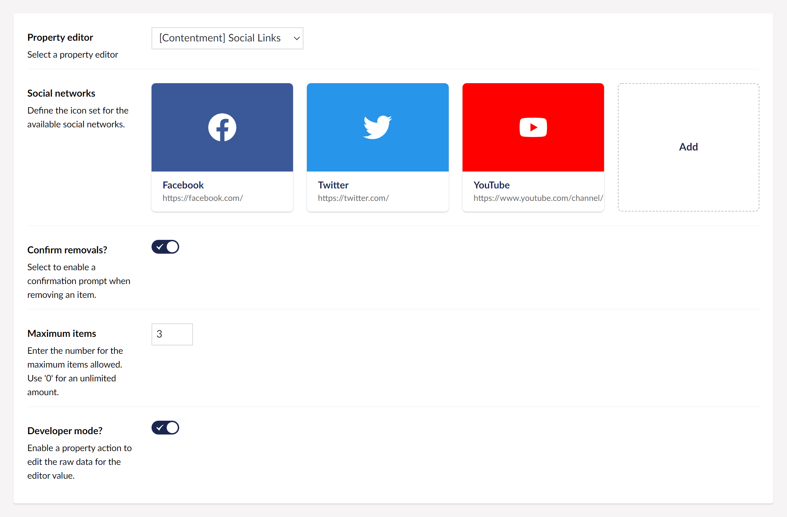
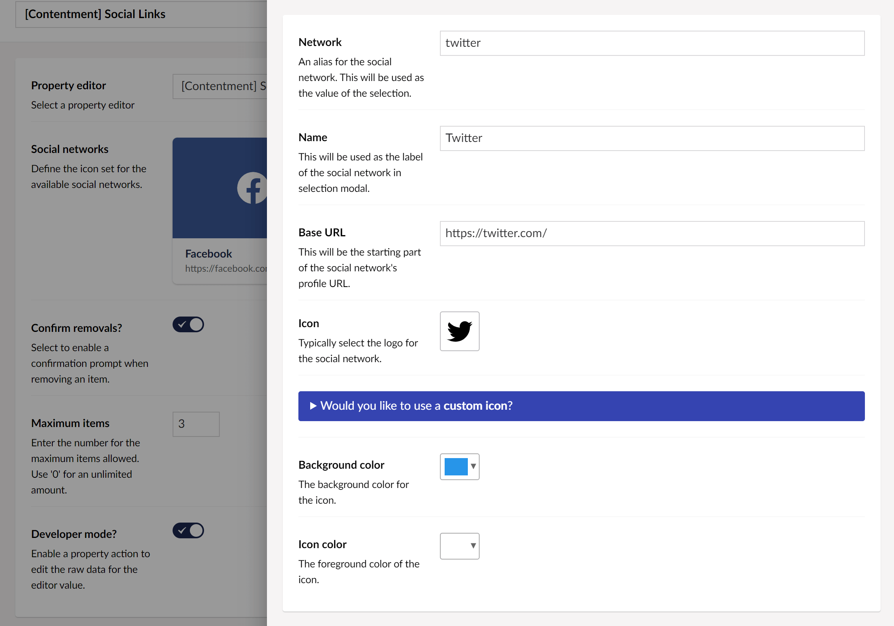
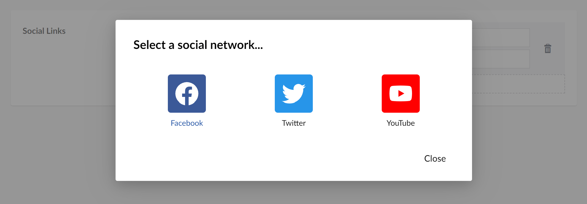
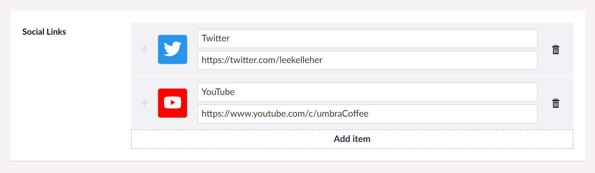

## Contentment for Umbraco

### Social Links

Social Links is a property-editor to manage links for configured social network platforms.


### How to configure the editor?

In your new Data Type, selected the "[Contentment] Social Links" option. You will see the following configuration fields.



The first field is **Social networks**, this is used to define the available social network platforms. Pressing the **Add** button, will open the following dialog panel.



Here you can specify the social network's alias (value), name label, and icon, along with the icon's color and background-color.

> Would you like to use a **custom icon**?
> To add your own custom icons to the Umbraco backoffice, add any SVG icon files to a custom plugin folder, e.g. `~/App_Plugins/[YourPluginName]/backoffice/icons/`.
> For a step-by-step guide, Warren Buckley has a video tutorial: [How to Add Custom SVG icons to Umbraco Icon Picker](https://www.youtube.com/watch?v=m90uxZBVFOw).

Once you have added your social network platforms, you can configure the rest of the fields.

The **Confirm removals?** option will enable a confirmation prompt for when removing a social link item.

The **Maximum items** field is used to limit the number of content blocks that the editor can have. Once the maximum is reached, the **Add** button will not be available.

Lastly, the **Developer mode?** option is a special feature for those who would like to have access to the raw JSON value of the Social Links editor. Enabling this option will add a [property action](https://our.umbraco.com/Documentation/Extending/Property-Editors/Property-Actions/) called **Edit raw value**.

When you are happy with the configuration, you can **Save** the Data Type and add it to your Document Type.


### How to use the editor?

Once you have added the configured Data Type on your Document Type, the Social Links editor will be displayed on the content page's property panel.

The editor will initially appear empty, by pressing the **Add item** button, an overlay with the available social network platforms will appear.



Selecting one of the available social network platforms, this will close the overlay and let you edit the social link's title and URL.




### How to get the value?

The value for the Social Links will be a [`IEnumerable<SocialLink>`](https://github.com/leekelleher/umbraco-contentment/blob/develop/src/Umbraco.Community.Contentment/DataEditors/SocialLinks/SocialLink.cs) object-type.

To use this in your view templates, here are some examples.

For our example, we'll assume that your property's alias is `"socialLinks"`, then...

Using Umbraco's Models Builder...

```cshtml
<nav>
    @foreach (var socialLink in Model.SocialLinks)
    {
        <a href="@socialLink.Url">
            <i class="fa-brands fa-@socialLink.Network"></i>
            <span>@socialLink.Name</span>
        </a>
    }
</nav>
```

...or if you don't need to loop over the values, you can access them directly like this...

```cshtml
@Model.SocialLinks["email"]
```

Without ModelsBuilder...

The weakly-typed API may give you some headaches, I suggest using strongly-typed, (or preferably Models Builder).

Here's an example of strongly-typed...

```cshtml
<nav>
     @{
        var socialLinks = Model.Value<IEnumerable<SocialLink>>("socialLinks");
        foreach (var socialLink in socialLinks)
        {
            <a href="@socialLink.Url">
                <i class="fa-brands fa-@socialLink.Network"></i>
                <span>@socialLink.Name</span>
            </a>
        }
    }
</nav>
```

#### What about social icons on the front-end?

This editor does not offer any social icons for your own website/implementation. In the code snippets above, I am using the [FontAwesome icons](https://fontawesome.com/) as an example.

If you need to find any specific social network platform icons, you could try the following resources:

- [FontAwesome "Brands" icon-set](https://fontawesome.com/search?s=brands)
- [Iconmonstr](https://iconmonstr.com/)
- [Iconfinder](https://www.iconfinder.com/)
