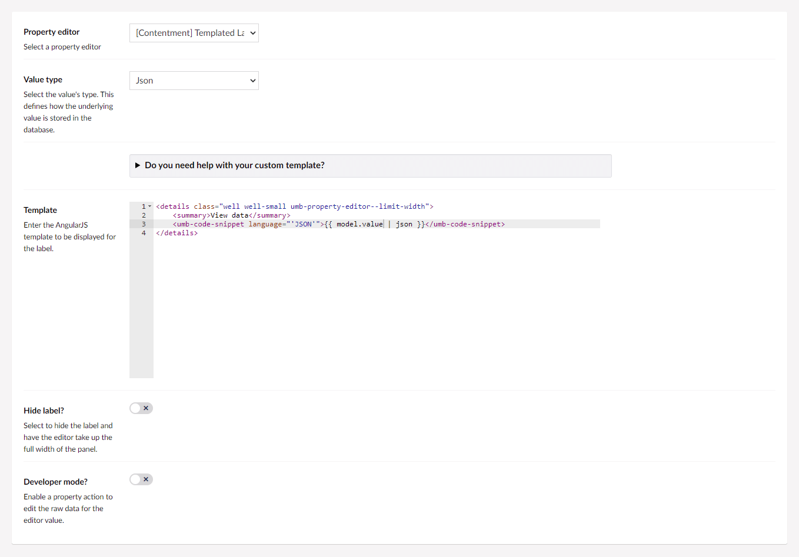

## Contentment for Umbraco

### Templated Label

Templated Label is a property-editor that can be used to display data, typically from a 3rd-party system.

> For background on this property-editor, [please see original suggestion on the GitHub discussion](https://github.com/leekelleher/umbraco-contentment/discussions/100).

You could use this editor as a richer replacement to [Umbraco's built-in **Label** property-editor](https://our.umbraco.com/Documentation/Fundamentals/Backoffice/Property-Editors/Built-in-Property-Editors/Label).


#### How to configure the editor?

In your new Data Type, selected the "[Contentment] Templated Label" option. You will see the following configuration fields.



The two main fields are "**Value type**" and "**Template**", the rest are for further configuration.

The **Value type** is similar to [Umbraco's Label configuration](https://our.umbraco.com/Documentation/Fundamentals/Backoffice/Property-Editors/Built-in-Property-Editors/Label#value-type), select the type that the underlying value will be. Essentially, this is how the value will be stored in a database table column.

The **Template** field uses Umbraco's ACE code editor to allow you to enter custom template markup as the display label. The template will be evaluated using AngularJS syntax, so you can use whatever expressions, filters or logic you desire to display the label's value. The value will be accessible with `model.value`.

If you need a starting point, here is an example you can use:

```html
<details class="well well-small umb-property-editor--limit-width">
    <summary>View data</summary>
    <umb-code-snippet language="'JSON'">{{ model.value | json }}</umb-code-snippet>
</details>
```

There are also options to **hide the label** on the property itself, and to **hide the property group container**. Selecting these option will enable the notes to be displayed in full width and outside of the content property panel.

Lastly, the **Developer mode?** option is a special feature for those who would like to have access to the raw value of the editor. Enabling this option will add a [property action](https://our.umbraco.com/Documentation/Extending/Property-Editors/Property-Actions/) called **Edit raw value**.

Once you have configured the Data Type, press the **Save** button and add it to your Document Type.


#### How to use the editor?

Once you have added the configured Data Type on your Document Type, the templated label will be displayed on the content page's property panel.


#### How to add values programmatically?

The way to programmatically add values to a property is the same as any other Umbraco content property. [Please read Umbraco's documentation on how to add values programmatically to the Label property-editor](https://our.umbraco.com/Documentation/Fundamentals/Backoffice/Property-Editors/Built-in-Property-Editors/Label#add-values-programmatically).


#### How to get the value?

The object-type of the value for the Templated Label depends on the **Value type** that has been configured on the Data Type.

If you have configured the value as a "Date" or "DateTime" then the object-type will be a `DateTime`; for "Time" it will be a `TimeSpan`; "Decimal" is a `decimal`; "Integer" is an `int`; and "Bigint" is a `long`; anything else will be returned as a `string` (including the "JSON" type).

For details on how to access the property value in a Razor view template, [please see Umbraco's Label documentation for MVC View examples](https://our.umbraco.com/Documentation/Fundamentals/Backoffice/Property-Editors/Built-in-Property-Editors/Label#mvc-view-example).

