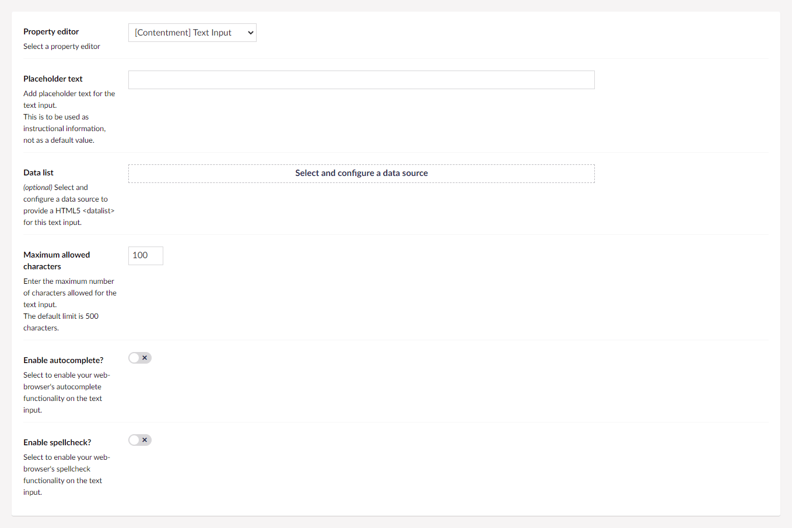
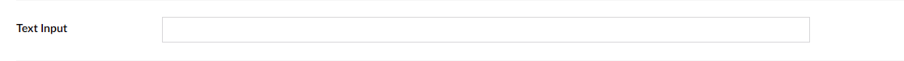

## Contentment for Umbraco

### Text Input

Text Input is a property-editor that is used to enter plain-text content, configurable with modern HTML5 options.

### How to configure the editor?

In your new Data Type, selected the "[Contentment] Text Input" option. You will see the following configuration fields.

The first field is **Input type**, which is used to configure the type of input expected. You can select from:
* **Text** (for normal text) - *this is the default*
* **Email** (for an email address)
* **Telephone** (for a telephone number)
* **URL** (for a web address)

> From an HTML5 perspective, this is the [`<input>`'s `type` attribute](https://developer.mozilla.org/en-US/docs/Learn/Forms/HTML5_input_types).

The second field is **Placeholder text**, which is used to add initial instructional information for the text input, this is not a default value.

> For technical users, from a HTML5 perspective, this is the [`<input>`'s `placeholder` attribute](https://developer.mozilla.org/en-US/docs/Web/HTML/Element/input/text#placeholder).

The next field is **Data list**, this is used to provide a list of predefined values to suggest to the user for the text input.

> For technical users, this is the [`<input>`'s `list` attribute](https://developer.mozilla.org/en-US/docs/Web/HTML/Element/input/text#list), making use of the [`<datalist>` element](https://developer.mozilla.org/en-US/docs/Web/HTML/Element/datalist).

The configuration of the data source uses the same approach as the **Data List** editor, [please see the documentation for example data source options](data-list.md#how-to-configure-the-editor).

> [An extensive list of all the **built-in data-sources** is available](../data-sources/README.md).

The **Maximum allowed characters** field is used to limit the number of characters that can be entered in the text input. The default limit is 500 characters.

The **Enable autocomplete?** option can enable your web-browser's autocomplete functionality on the text input.

> For technical users, this is the [`<input>`'s `autocomplete` attribute](https://developer.mozilla.org/en-US/docs/Web/HTML/Element/input#attr-autocomplete).

The **Enable spellcheck?** option can enable your web-browser's spellcheck functionality on the text input.

> For technical users, this is the [`<input>`'s `spellcheck` attribute](https://developer.mozilla.org/en-US/docs/Web/HTML/Element/input/text#spellcheck).

The **Prepend icon** - allows you to optionally select an icon that is shown before your input control.

The **Append icon** - this allows you to optionally select an icon that is shown after your input control.

### How to use the editor?

Once you have added the configured Data Type to your Document Type, the Text Input editor will be displayed on the content page's property panel.

Visually, this is similar to [Umbraco's Textbox editor](https://our.umbraco.com/Documentation/Getting-Started/Backoffice/Property-Editors/Built-in-Property-Editors/Textbox/#content-example).

### How to get the value?

The value for the Text Input is a `string`.

Programmatically, you would access the value exactly the same as Umbraco's Textbox editor, [see Umbraco's documentation for code snippet examples](https://our.umbraco.com/Documentation/Getting-Started/Backoffice/Property-Editors/Built-in-Property-Editors/Textbox/#mvc-view-example).

### Further reading

- [Umbraco documentation on built-in **Textbox** property editor](https://our.umbraco.com/Documentation/Getting-Started/Backoffice/Property-Editors/Built-in-Property-Editors/Textbox/)
- [MDN Web documentation on `<input type="text">` element](https://developer.mozilla.org/en-US/docs/Web/HTML/Element/input/text)
- [MDN Web documentation on `<datalist>`: The HTML Data List element](https://developer.mozilla.org/en-US/docs/Web/HTML/Element/datalist)

