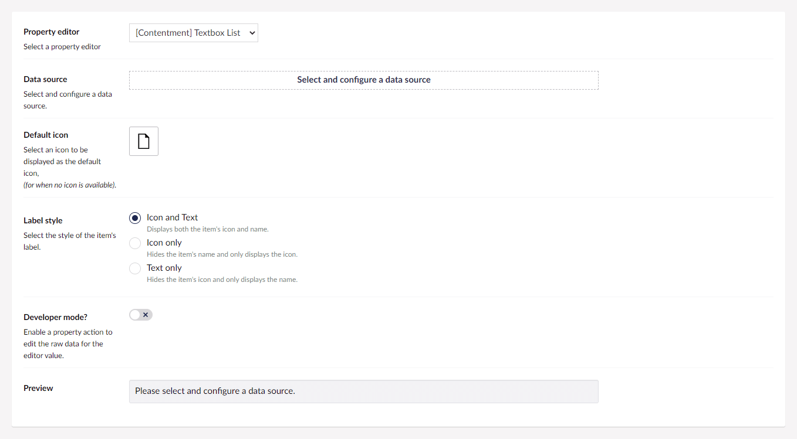
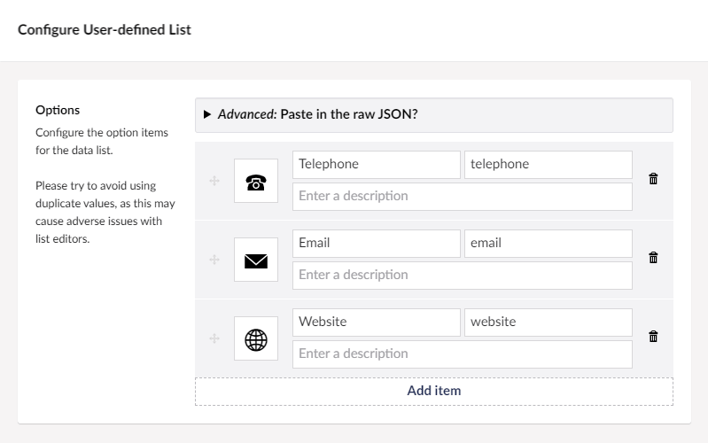
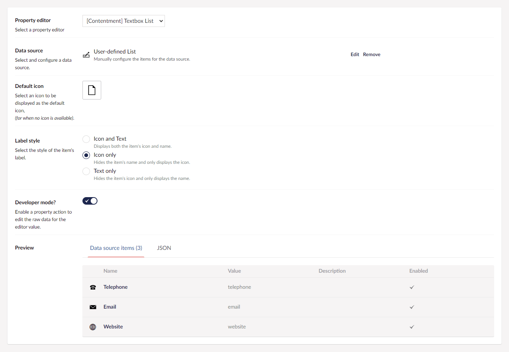
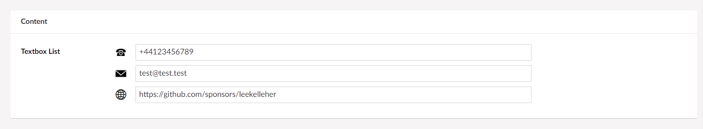

## Contentment for Umbraco

### Textbox List

Textbox List is a property-editor that uses a data-source to give you a textbox for each item in the data-source.

> This property-editor has taken inspiration from the community packages, [KeyValue Editor](https://our.umbraco.com/packages/backoffice-extensions/keyvalue-editor/) by Chriztian Steinmeier and [Multilanguage Textbox](https://our.umbraco.com/packages/backoffice-extensions/multilanguage-textbox/) by Dave Woestenborghs.

For information about data-sources, please see [the documentation for the Data List property-editor](data-list.md).


### How to configure the editor?

In your new Data Type, selected the "[Contentment] Textbox List" option. You will see the following configuration fields.



The first field is **Data source**, this is used to provide a list of predefined values to suggest to the user for the textbox list.

The configuration of the data source uses the same approach as the **Data List** editor, [please see the documentation for example data source options](data-list.md#how-to-configure-the-editor).

> [An extensive list of all the **built-in data-sources** is available](../data-sources/README.md).

For our example, let's choose **User-defined List**. You will then be presented with configuration options for this data source.





Once you have configured the data source, press the **Done** button at the bottom of the overlay. You should notice that the **Preview** for the data source has been updated.

The next fields, **Default icon** and **Label style** are for the presentation of the icon and label that is associated with each textbox in the list.

When you are happy with the configuration, you can **Save** the Data Type and add it to your Document Type.


### How to use the editor?

Once you have added the configured Data Type to your Document Type, the Textbox List editor will be displayed on the content page's property panel.




### How to get the value?

The value for the Textbox List will be a [`NameValueCollection`](https://docs.microsoft.com/en-us/dotnet/api/system.collections.specialized.namevaluecollection) object-type.

To use this in your view templates, here are some examples.

For our example, we'll assume that your property's alias is `"textboxList"`, then...

Using Umbraco's Models Builder...

```cshtml
<dl>
    @foreach (var key in Model.TextboxList.AllKeys)
    {
        <dt>@key</dt>
        <dd>@Model.TextboxList[key]</dd>
    }
</dl>
```

...or if you don't need to loop over the values, you can access them directly like this...

```cshtml
@Model.TextboxList["email"]
```

Without ModelsBuilder...

The weakly-typed API may give you some headaches, I suggest using strongly-typed, (or preferably Models Builder).

Here's an example of strongly-typed...

```cshtml
<dl>
    @foreach (var key in Model.Value<System.Collections.Specialized.NameValueCollection>("textboxList").AllKeys)
    {
        <dt>@key</dt>
        <dd>@Model.TextboxList[key]</dd>
    }
</dl>
```


